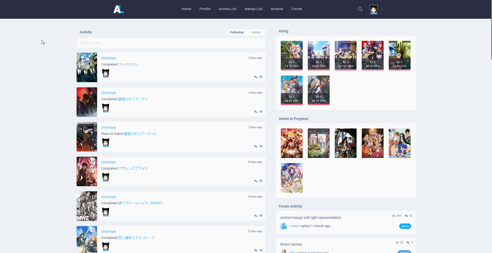
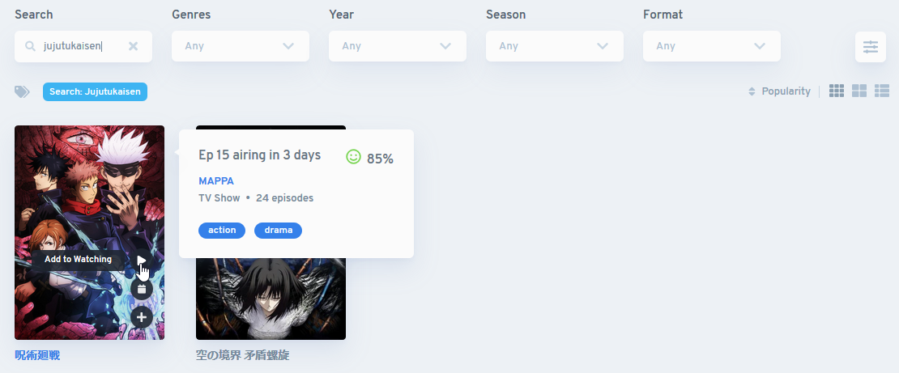

普段 Amazon prime video や Netflix で大量にアニメを見る人におすすめなツール『Anilist.co』の紹介。

あまりメジャーでないのか、記事が殆どなかったので記録がてらに書きます。



## Anilist とは

アニメの視聴状況を記録しておくことができるサイト。自分は漫画は読まないので使っていないが恐らく漫画のタイトルも存在する。

アカウントを作成したら多分こんな感じ。

簡単に使い方を紹介。

### そのまえに

個人的にやっておいたほうが幸せな設定。

[Settings](https://anilist.co/settings) の Anime&Media タブから Title Language を Native に変更しておくと、検索した際のタイトル表示が日本語になって見つけやすい。

## アニメを探す

[Browse](https://anilist.co/search/anime) からお目当てのアニメを探す。

特定のアニメを探すだけではなく、ホットなアニメや最近公開されたアニメを見つけたりジャンルから検索もできるので、次に何を見るか探すのにも使える。

探したいアニメがある方は、 検索窓にタイトルを入れて検索。日本語でも英語でも、結構適当に入れても出てくる。

カーソルをかざすと + マークが出てくるので、そこから今見てるか、これから見たいかを選んでリストに追加できる。

ついでに、アニメを探す際に一々タイトルをコピーして貼り付けて…とやるのは面倒なので、便利な拡張機能も合わせてご紹介。 Edge/Chrome/Firefox で利用できる。



例えば自分の場合、「Amazon prime video や Netflix でアニメを見つけて、見つけたアニメを Anilist へ登録したい」というユースケースなので、この拡張を入れておくとタイトルを選択して右クリックするとメニューから即座に Anilist で検索できる。

## 視聴状況を確認・編集する

[Anime List](https://anilist.co/user/shiomiya/animelist) から現在の視聴状況を確認・編集できる。

## おわりに

まだ活用していませんが (というか使っている知り合いがいない) 、フレンド機能からアニメをリサーチできると面白そう。

もしよければアニメ好きの方、ぜひ登録してフォローをしてください。


