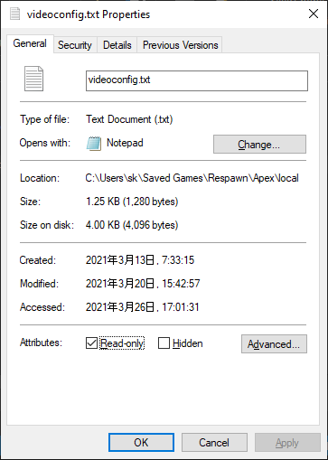

Apex Legends で普通に 4:3 引き伸ばしを使おうとすると上下に黒帯が出るのでそれを消す方法メモ。

4:3 でも、5:4 でも使える。

1. `C:\Users\<username>\Saved Games\Respawn\Apex\local` の `videoconfig.txt` を開いて該当箇所を以下のように変更する。解像度は適宜置き換えても可。

```
"setting.defaultres"		"1280"
"setting.defaultresheight"		"1024"
"setting.fullscreen"		"0"
"setting.nowindowborder"		"1"
```

2. 保存したら `videoconfig.txt` のプロパティから読み取り専用にチェックを入れる。



3. Apex Legends の起動オプションに以下を追記する。

```
+building_cubemaps 1
```

4. Apex Legends を起動したら Ctrl + Alt + Enter。

終わり。

> https://www.bilibili.com/video/av842833499/