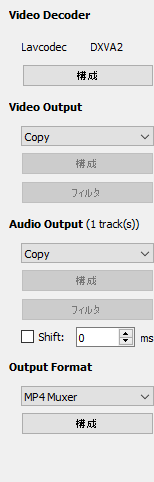
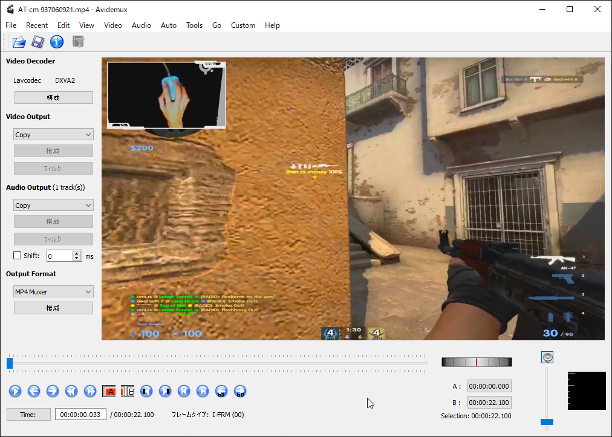

Davinci Resolve とか Aviutl とか、フリーでも高機能な動画編集ソフトはあるけど、メインの動画投稿先が Twitter の人にとってはそんなすごいのはいらない感がある。 (くだらん動画のためにいちいちプロジェクト作成するとか面倒臭すぎる)

劣化ほぼなしで動画のトリミングと結合だけできれば満足なんですが、意外とそういうのがなかったのでご紹介。

これまで Microsoft Photo のトリミング機能でやってたけど、 60fps の動画がトリミング後にフレームレートが低下したり劣化がひどいのでダメ。

## インストール

[Avidemux - Downloads](http://avidemux.sourceforge.net/download.html)

ここから自分の環境にあったものをインストール。

### 設定項目

言うてほとんどないですが、強いて言えば僕は mp4 の動画しか編集しないので以下のように設定。

|||
|--- |--- |
|Video Output|Copy|
|Audio Output|Copy|
|Output Format|MP4 Muxer|

Edit > Save current setting as default をクリック。終わり。

Video Output でコーデックを指定すればそこそこ凝った編集はできるみたい。

## 編集

インタフェースはこんな感じで、下のボタンとスライダーくらいしか使うものはなし。

ポチポチ触ってればだいたい分かるけど、トリミングに使う機能だけ紹介する。

- A -> <kbd>Delete</kbd>: ここから消す
- B -> <kbd>Delete</kbd>: ここまで消す
- A B -> <kbd>Delete</kbd>: ここからここまで消す

みたいな感じ。

後ろに新しい動画をつなげたいときは、 File -> Append で動画を選択。

解像度が違う動画同士は基本繋げられないけど、なんとかする方法はあるっぽい (自分は使わないので割愛)。



編集が終わったら Ctrl-S で保存。

サクッと編集してサクッと上げたい人におすすめの編集ソフトです。
