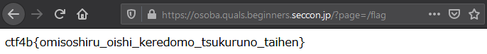
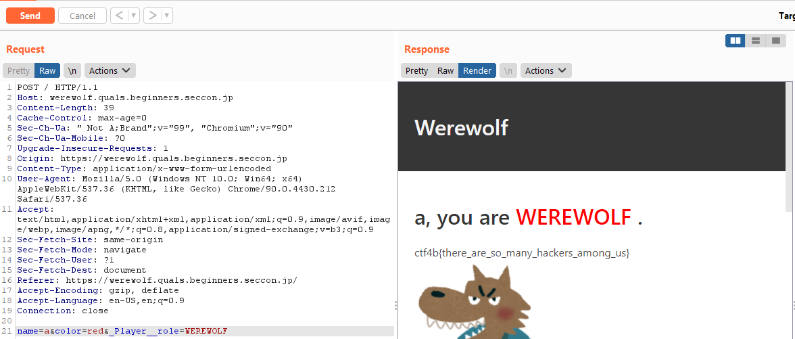
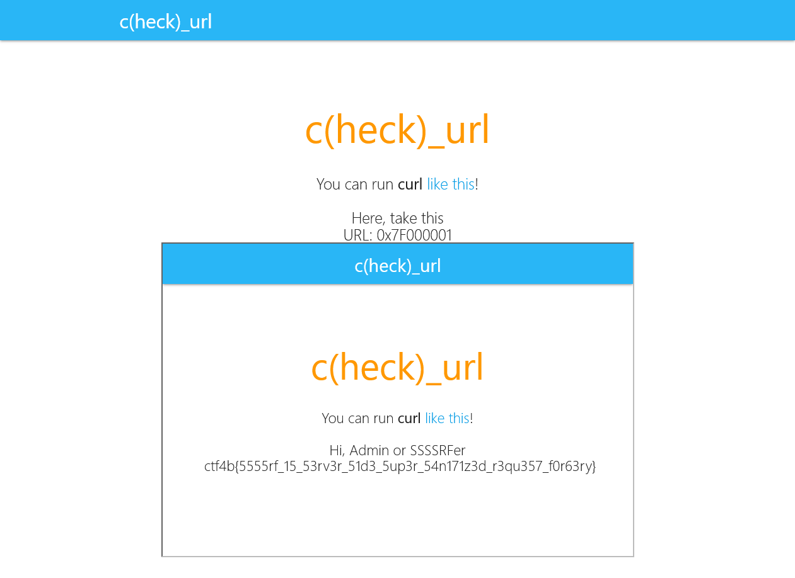

CTF に初参戦したので、参加記兼 Writeup ということで書きます。

超初心者目線での writeup になるのでこの記事を読んでいる方は温かい目で見守ってください。

writeup としてはかぶる点ばかりなので、最後の感想でも見ていってください。

## writeup

分野別に、とりあえずなんとなく理解できたもののみ書きます。

### reversing

#### only_read

> バイナリ読めなきゃやばいなり〜

実際は ghidra にブチ込んだんですが、一応ちゃんとやります。

とりあえず実行してみると、標準入力を受け付けていることがわかります。適当に入力すると `Incorrect` が出力されたので、中でなにか比較してるんだろうな～と推測できます。

比較が走っているということを前提に、`objdump` で disassemble して中身を見てみます。

```
$ objdump -d chall | grep cmp
    10de:       48 39 f8                cmp    %rdi,%rax
    1144:       80 3d c5 2e 00 00 00    cmpb   $0x0,0x2ec5(%rip)        # 4010 <__TMC_END__>
    114e:       48 83 3d a2 2e 00 00    cmpq   $0x0,0x2ea2(%rip)        # 3ff8 <__cxa_finalize@GLIBC_2.2.5>
    11e4:       3c 63                   cmp    $0x63,%al
    11f0:       3c 74                   cmp    $0x74,%al
    11fc:       3c 66                   cmp    $0x66,%al
    1208:       3c 34                   cmp    $0x34,%al
    1214:       3c 62                   cmp    $0x62,%al
    1220:       3c 7b                   cmp    $0x7b,%al
    122c:       3c 63                   cmp    $0x63,%al
    1238:       3c 30                   cmp    $0x30,%al
    1244:       3c 6e                   cmp    $0x6e,%al
    124c:       3c 35                   cmp    $0x35,%al
    1254:       3c 74                   cmp    $0x74,%al
    125c:       3c 34                   cmp    $0x34,%al
    1264:       3c 6e                   cmp    $0x6e,%al
    126c:       3c 74                   cmp    $0x74,%al
    1274:       3c 5f                   cmp    $0x5f,%al
    127c:       3c 66                   cmp    $0x66,%al
    1284:       3c 30                   cmp    $0x30,%al
    128c:       3c 6c                   cmp    $0x6c,%al
    1294:       3c 64                   cmp    $0x64,%al
    129c:       3c 31                   cmp    $0x31,%al
    12a4:       3c 6e                   cmp    $0x6e,%al
    12ac:       3c 67                   cmp    $0x67,%al
    12b4:       3c 7d                   cmp    $0x7d,%al
    1341:       48 39 dd                cmp    %rbx,%rbp
```

最高に怪しいので、3 列目あたりを awk で全部取り出して ascii に変換してみます。

本当は全部手作業でやったんですが、せっかくなのでスクリプトっぽくします。

```
$ objdump -d chall | \grep cmp | awk '{print $3}' | xargs -I% python3 -c "import binascii;print(binascii.unhexlify(b'%').decode(), end='')" 2>/dev/null

9=ctf4b{c0n5t4nt_f0ld1ng}9
```

若干ゴミが混じってますが、分かるのでいいです。

#### children

> これから10個の子プロセスを作るよ。 彼らの情報を正しく答えられたら、FLAGをあげるね。 ちなみに、子プロセスは追加の子プロセスを生む可能性があるから注意してね。

実行すると、子プロセスの pid を聞かれます。

正直理解はしていませんが、gdb 上で走らせてみると、gdb が都度 pid を出力していることに気づいてしまったので、それから普通にいけてしまいました。gdb に感謝。

```
$ gdb children
(gdb) r

[Detaching after fork from child process 394]
Please give me my child pid!
394
ok
[Detaching after fork from child process 395]
Please give me my child pid!
395
ok
[Detaching after fork from child process 396]
[Detaching after fork from child process 397]
Please give me my child pid!
397
ok
[Detaching after fork from child process 398]
Please give me my child pid!
398
ok
[Detaching after fork from child process 399]
Please give me my child pid!
399
ok
[Detaching after fork from child process 400]
Please give me my child pid!
400
ok
[Detaching after fork from child process 401]
Please give me my child pid!
401
ok
[Detaching after fork from child process 402]
Please give me my child pid!
402
ok
[Detaching after fork from child process 403]
Please give me my child pid!
403
ok
[Detaching after fork from child process 404]
[Detaching after fork from child process 405]
Please give me my child pid!
405
ok
How many children were born?
12
ctf4b{p0werfu1_tr4sing_t0015_15_usefu1} [Inferior 1 (process 390) exited normally]
```

#### please_not_trace_me

`b4ftc` とかいうスカな感じの文字列を発見しただけで、これは結局解けませんでした。

- とりあえず ghidra に食わせて `not trace me...` している アドレスを探す
- trace ができるように Vim でバイナリを書き換える

まではできたんですが、あと一歩ができませんでした。

rc4 の key と暗号文がハードコードされているっぽいので、そこから導出している writeup を見つけたので、後でやってみることにします。



その他スゲーって感じた解法も。



この問題のせいで夜中まで悩んだので、後日の業務が激眠でした。

### web

#### osoba

> 美味しいお蕎麦を食べたいですね。フラグはサーバの /flag にあります！ https://osoba.quals.beginners.seccon.jp/

適当な記事の詳細にアクセスすると、エラー画面になるものの URL パラメータに何やら怪しいパラメータが付いてます。

```
https://osoba.quals.beginners.seccon.jp/?page=public/wip.html
```

お、トラバーサルか？と思いましたが、コメント通り `/flag` にありました。



#### Werewolf

> I wish I could play as a werewolf...

僕は極力人狼サイドにはなりたくありませんが、仕方がありません。

サーバーのコードがおいてあるのでとりあえず中身を見ます。

全体のコードは省きますが、注目すべきは `Player` クラスと `index` 関数あたりです。

まず、何が起きたら flag が取れるのかを知ります。

```python
@app.route("/", methods=["GET", "POST"])
def index():
    if request.method == 'GET':
        return render_template('index.html')

    if request.method == 'POST':
        player = Player()

        for k, v in request.form.items():
            player.__dict__[k] = v

        return render_template('result.html',
            name=player.name,
            color=player.color,
            role=player.role,
            flag=app.FLAG if player.role == 'WEREWOLF' else ''
        )
```

`index` 関数の最終行あたりを見る限り、`player.role == 'WEREWOLF` な場合に flag を取り出してくれるようです。

ついでにその手前部分も見ていくと、`/` に `POST` されたタイミングで `Player` インスタンスを生成して、`__dict__` にパラメータ名と value を格納していくという感じでしょうか。で、render のタイミングで `__dict__` から取り出しています。

あれ、`__dict__` なんていたっけ？ということも踏まえて、次に `Player` クラスがどうなっているかを見ていきます。

ちょこっとコードを切り出して、`__dict__` が何かをとりあえず確認します。

```python
import random

class Player:
    def __init__(self):
        self.name = None
        self.color = None
        self.__role = random.choice(['VILLAGER', 'FORTUNE_TELLER', 'PSYCHIC', 'KNIGHT', 'MADMAN'])
        # :-)
        # self.__role = random.choice(['VILLAGER', 'FORTUNE_TELLER', 'PSYCHIC', 'KNIGHT', 'MADMAN', 'WEREWOLF'])

    @property
    def role(self):
        return self.__role

player = Player()

print(player.__dict__)
```

これの出力が以下です。

```
{'name': None, 'color': None, '_Player__role': 'FORTUNE_TELLER'}
```

`_Player__role` が怪しいです。`index` の中を見ると、

```python
for k, v in request.form.items():
  player.__dict__[k] = v
```

としていて、何やら上書きできそうな処理を書いてくれています。

これをもとに、Burp あたりを使ってパラメータを弄ってリクエストを飛ばしてみます。



見事 flag をゲットできました！

#### check_url

> Have you ever used curl ?
> https://check-url.quals.beginners.seccon.jp/

`index.php` を読むと、以下のことがわかります。

- リモートアドレスが `127.0.0.1` である場合に flag が表示される
- `https://www.example.com` 以外の URL は、英数字と `:` と `/` 以外の文字列が:ghost:でエスケープされる
- `localhost`、`apache` を含む文字列は許可されていない

知らなかったのでめちゃくちゃ考えましたが、要は「`127.0.0.1` を何かしらの英数字で表せることができれば良い」ということでした。

適当な IP Converter を使って片っ端から変換して試します。結果、Hex 表記の場合で無事 flag が取れました。

```
https://check-url.quals.beginners.seccon.jp/?url=0x7F000001
```



### misc

#### git-leak

与えられた README にも書いてあるので、`reflog` します。

```
$ git reflog
e0b545f (HEAD -> master) HEAD@{0}: commit (amend): feat: めもを追加
80f3044 HEAD@{1}: commit (amend): feat: めもを追加
b3bfb5c HEAD@{2}: rebase -i (finish): returning to refs/heads/master
b3bfb5c HEAD@{3}: commit (amend): feat: めもを追加
7387982 HEAD@{4}: rebase -i: fast-forward
36a4809 HEAD@{5}: rebase -i (start): checkout HEAD~2
7387982 HEAD@{6}: reset: moving to HEAD
7387982 HEAD@{7}: commit: feat: めもを追加
36a4809 HEAD@{8}: commit: feat: commit-treeの説明を追加
9ac9b0c HEAD@{9}: commit: change: 順番を変更
8fc078d HEAD@{10}: commit: feat: git cat-fileの説明を追加
d3b47fe HEAD@{11}: commit: feat: fsckを追記する
f66de64 HEAD@{12}: commit: feat: reflogの説明追加
d5aeffe HEAD@{13}: commit: feat: resetの説明を追加
a4f7fe9 HEAD@{14}: commit: feat: git logの説明を追加
9fcb006 HEAD@{15}: commit: feat: git commitの説明追加
6d21e22 HEAD@{16}: commit: feat: git addの説明を追加
656db59 HEAD@{17}: commit: feat: add README.md
c27f346 HEAD@{18}: commit (initial): initial commit
```

コミットハッシュが `7387982` のところで `reset` や `rebase` してるので怪しいです。`cat-file` してオブジェクトの中身を見ます。

```
$ git cat-file -p 7387982
tree a5b6b52f47aba96730ab61471ddcdff864e5dd8c
parent 36a4809f1ae8013432eb52cfd2f9f062a3269499
author task4233 <29667656+task4233@users.noreply.github.com> 1620491725 +0900
committer task4233 <29667656+task4233@users.noreply.github.com> 1620491725 +0900
```

確か `tree` が実在していたファイルとコミットハッシュの対応を格納しているオブジェクトだった気がするので見てみます。

```
$ git cat-file -p a5b6b52f47aba96730ab61471ddcdff864e5dd8c
100644 blob 16290835a0f74ccf30cbf30d791c84392a9dcce6    README.md
100644 blob 4cbb035d2ff072127b4e22919485127d2273e88e    flag.txt
100644 blob 62337fdb59ceb048f7da9eaf768923d744930842    note.md
```

`flag.txt` がありました～！ので、あとは中身を見て終わりです。

```
$ git cat-file -p 4cbb035d2ff072127b4e22919485127d2273e88e
ctf4b{0verwr1te_1s_n0t_c0mplete_1n_G1t}
```

多分 `git reset` してしまえば一瞬だったと思います。

## 感想

これまで、「出てもどうせあんまり解けないし...」とか、「ちゃんと勉強してから...」とか言って出ていませんでしたが、もっと早く出ておけばよかったと後悔しました。writeup くらいは読んだことがありましたが、いうても出場していない自分にとっては他人事なので、熱量をもって問題を見れなくて「あとででいいか」となって結局やらないってことがほとんどでした。

同じ感じでウジウジしている人は友達とか誘って、スコア度外視で酒でも飲みながら解いていくとめちゃくちゃ楽しいと思います。というか楽しかったです。

今回でモチベーション爆上がりしたので、個人では rev、pwn あたりを勉強して、 CTFTimes なんかで出れそうなやつを探して単騎でも出てみようと思います。

以上、SECCON Beginners CTF writeup と参加記でした。