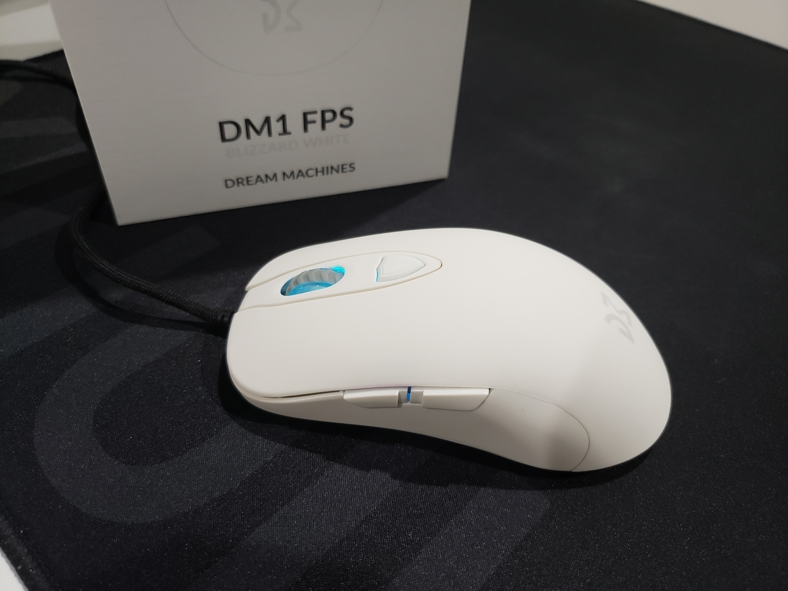
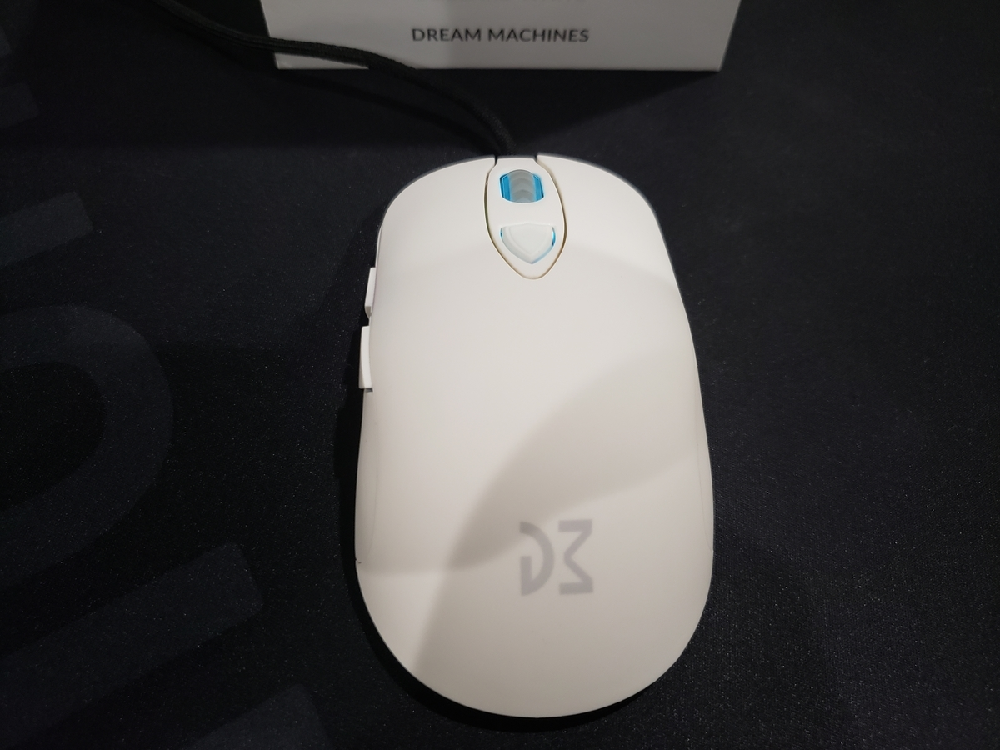
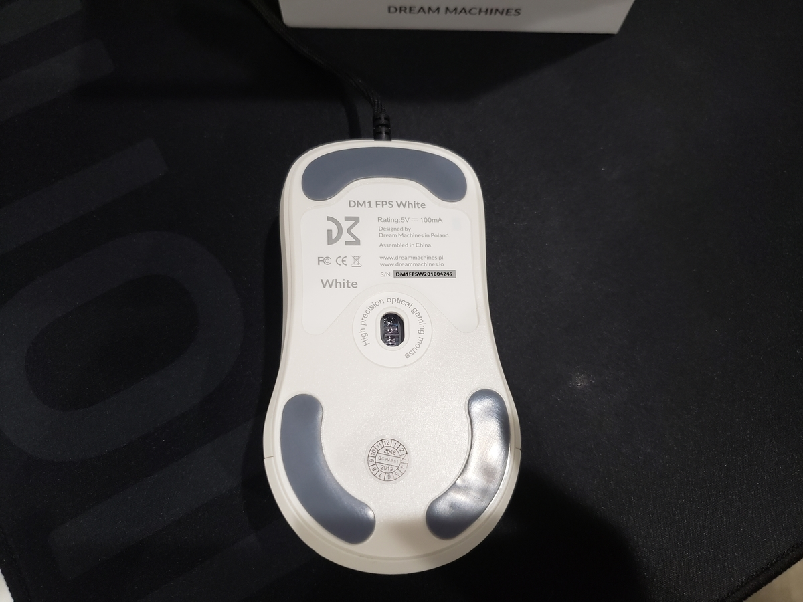
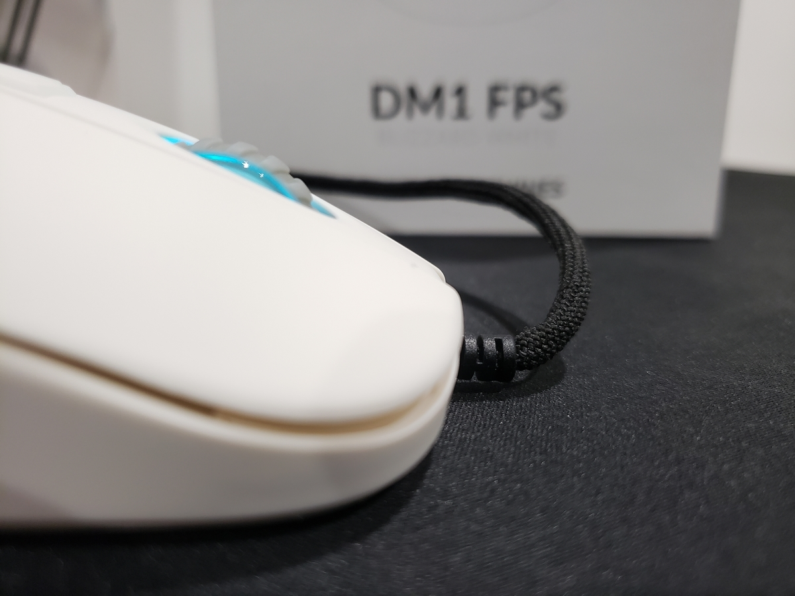

+++
date = "2020-02-18 00:03:00 +0000 UTC"
draft = false
title = "DREAM MACHINES DM1 FPS レビュー"
tags = ["mouse"]
categories = ["review"]
+++

auPayの20%還元期間だったのでずっと買うか迷ってた DM1 FPS をパソコンショップArkで買ってきました. 一緒にマウスグリップシールも買って8,000円くらい. 因みに1,600円くらい還元された.

## 外観

お色は BLIZZARD WHITE

全体的にマットな質感で, 手汗が吹き出す僕でもあまり滑らなさそう. ただずっと使っているとベタついてきそうな感じ.

形はいわゆる senseiクローン (だと思う)

ソールまで sensei みたい. 同じソール貼れそうな感じするけど貼れるのかな

で, ケーブルは finalmouse みたいなパラコード

## (スペック) とお気持ち

基本スペックはArkにあるものを

[DM1 FPS - Blizzard White](https://www.ark-pc.co.jp/i/50282781/)

PixArt PMW3389 センサ搭載なのでセンサスペックはおそらく現行で一番いい (はず) . と, この辺のことは各所で言及されているので割愛.

重心がほぼど真ん中なので, 個人的にはかなりマウスを振りやすいです.

今まで使っていた S2 と比べて垂直上方向に力をかけやすいので公式重量は僅かに S2 が上なのに DM1 FPS のほうがやや軽く感じる.

クリックは固めです. 個人的に.

## 気になった点

### ソール

1年間交換していないS2純正ソールに慣れてしまったからか分かりませんが, めちゃくちゃ滑るように感じました. いや, 多分勘違い.

あと右下のソールが若干はみ出ていたのでそのへんの作業は適当なのかな

いないと思いますがソールの保護シールの剥がし忘れに注意. いないと思いますが.

### ケーブル

ケーブル自体ではなくケーブルの生え際に難有りで, なんか若干下向きについてる

個体によってはマウスパッドと干渉しそう. 少し反対側に押しておいた.

## 総評

サイズも形も重量も特に違和感はないのでしばらく使っていけそう.

クリックの固いシャコタンマウスに嫌悪感がなければおすすめできそうです.

