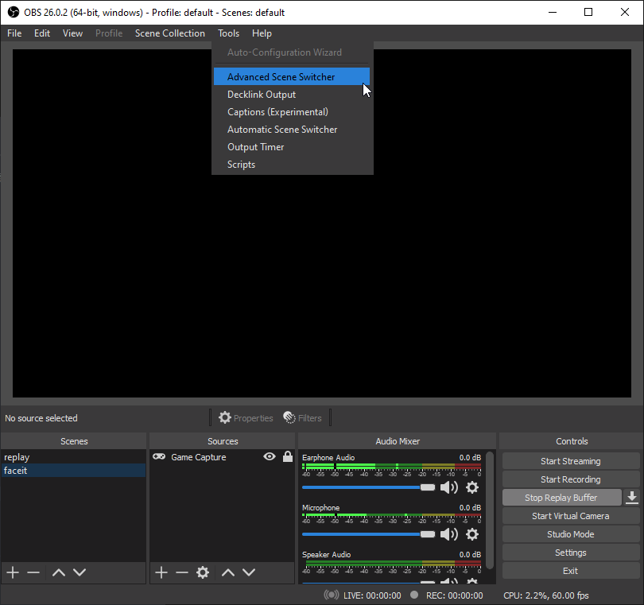
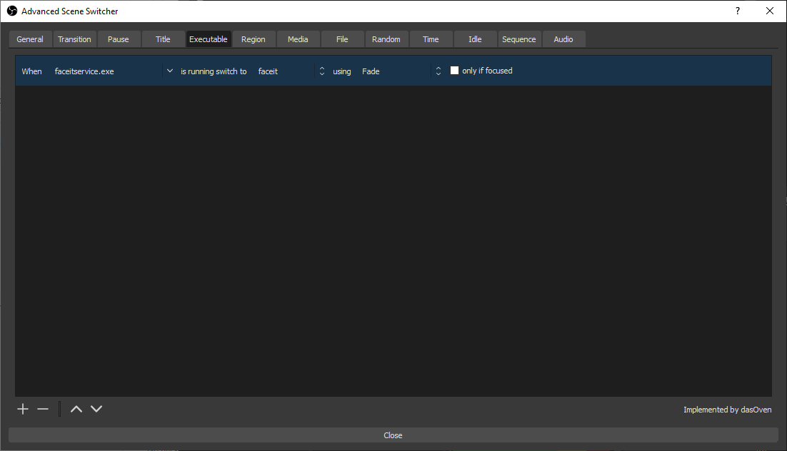

タイトルの通り。

## ことの発端

OBS の Replay Buffer を CSGO で利用する際、 MM で遊ぶ際にはディスプレイキャプチャ、 Faceit で遊ぶ際にはゲームキャプチャをキャプチャソースに利用しなければならず、これをなんとかして解決したかった。

Faceit をプレイする際には 『FACEITAC』と呼ばれるアンチチートソフトを常に起動しておく必要があるため、このプログラムの起動中にはキャプチャソースにゲームキャプチャを使うようにできればうまくいきそうだな ~ と思っていた。

## OBS 標準のシーンスイッチャー

OBS には Automatic Scene Switcher 標準でこのような悩みを解決できそうな機能が備わっている。

がしかしこの機能、どうやらアクティブウィンドウによってシーンが制御されるようで、 FACEITAC のようなバックグラウンドで起動させておくプログラムでは期待する動きにはならなかった。

~~まあ普通シーンの自動切り替えをする場合って、生放送時にゲーム A と B でオーバーレイが違うのを自動で切り替えたい人向けな気もするのでこれが普通なんだろうな、多分。~~

## Advanced Scene Switcher という選択肢

と、半ば諦めかけていたところ、以下の OBS プラグインを発見した。

> [Advanced Scene Switcher | OBS Forums](https://obsproject.com/forum/resources/advanced-scene-switcher.395/)

やはり探せばある (検索割と上位なのになぜ今まで見つけられなかったんだろう)。

前置きが長くなってしまったが、今回はこれを利用したシーンの自動切り替え方法の紹介。

以下で紹介する設定は CSGO で MM と FACEIT を遊ぶ際に手動でソースを切り替えることなくゲームをキャプチャすることだけを目的とした設定なので、それ以外の目的でこの記事を見つけた人は適宜変更が必要。

## プラグインのインストール

書いてあるんですが一応。

以下のリンクから SceneSwitcher.zip をダウンロードして解凍。

https://github.com/WarmUpTill/SceneSwitcher/releases

解凍すると OS ごとのフォルダがあるので、自分にあったのを探す。

64bit の中にある advanced-scene-switcher.dll をコピーして、 OBS のプラグインフォルダ (`C:\Program Files\obs-studio\obs-plugins\64bit`) へ貼り付け。

これで終わり。 OBS が起動中なら再起動。

## プラグインの設定

プラグインのインストールが完了すると、ツール > Advanced Scene Switcher から設定が行える。

### 着火剤の設定

Executable タブから、着火剤となるプログラムを設定する。

左下の + ボタンから設定を追加。

設定項目は左から順に

- 着火剤にするプログラム
- そのプログラムで利用するシーン名
- 切り替えの際のエフェクト
- アクティブウィンドウでなくても適用するか (これがでかい!)

となっている。

今回の自分の場合だと

- faceitservice.exe
- faceit
- Fade
- only if focused からチェックを外す

### シーン自動切り替えの有効化

General タブに戻って残りの設定をする。

#### Status

- Advance Scene Switcher is が Inactive な場合、下にある Start から Active にする。
- On startup: Always start the scene switcher

#### General behavior

- If no switch condition is met for `1.00s`
  - [x] Switch to: `replay`
  - (この設定をしておくと、 Executable で設定したプログラムが設定した秒間に検出されない場合に自動で指定したシーンに切り替わる様になる)

その他は全てチェックを外す。

これで自動切り替えの設定は終わり。

## おわりに

同じゲームをプレイするのにソースをわざわざ切り替えなければならず非常にストレスだったのが 100% 解消されて大満足。

今回は主に MM x FACEIT で CSGO をプレイする人向けに記事を書いたけど、ゲームによって手動でシーンを切り替えている配信者はよく見かけるので、配信者にもおすすめできそうな気がした。
