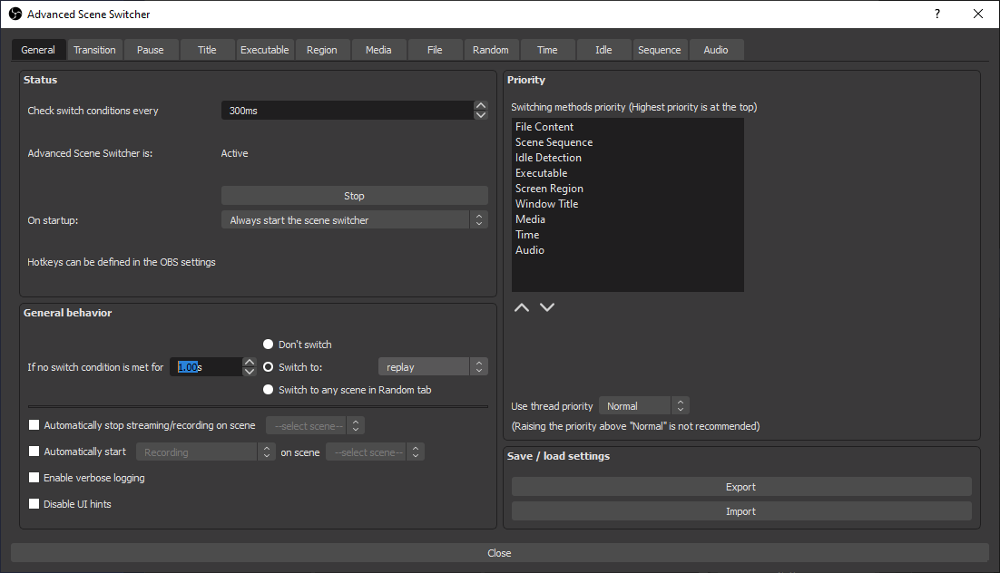

タイトルの通り。実行しているプログラムによって OBS のシーンを自動で切り替える方法。

## ことの発端

普段ゲームのクリップを残すために OBS の Replay Buffer を利用している。

メインでプレイしている CSGO のゲーム画面を OBS の Replay Buffer でキャプチャする際、 MM、5e で遊ぶ際にはディスプレイキャプチャ、 Faceit で遊ぶ際にはゲームキャプチャをキャプチャソースに利用しなければならず、いちいち手動で切り替えているとたまに切り替え忘れて画面が真っ暗なんて悲しい思いをする事があって、これをなんとかして解決したかった。

## Advanced Scene Switcher

Faceit をプレイする際には『FACEITAC』と呼ばれるアンチチートソフトを常に起動しておく必要があるため、このプログラムの起動中は特定のシーンに切り替わるようにすればうまくいく。

OBS 標準の シーンスイッチャーでは今回やりたいことができそうにないので、以下のプラグインを利用する。



## プラグインのインストール

書いてあるんですが一応。

先程のページ右側の [Go to download](https://obsproject.com/forum/resources/advanced-scene-switcher.395/download) から zip をダウンロード。

解凍すると OS ごとのフォルダがあるので、自分にあったのを探す。

64bit の中にある advanced-scene-switcher.dll をコピーして、 OBS のプラグインフォルダ (`C:\Program Files\obs-studio\obs-plugins\64bit`) へ貼り付け。

もしくはインストーラーを使っても OK。

プラグインのインストールはこれで終わり。 OBS が起動中なら再起動。

## シーンの下準備

ディスプレイソースを持つシーンとゲームキャプチャを持つシーンの 2 つのシーンを作成しておく。

## プラグインの設定

プラグインのインストールが完了すると、ツール > Advanced Scene Switcher から設定が行える。

### イベントの設定

Executable タブからイベントを設定する。

左下の + ボタンから設定を追加。

設定項目は左から順に

- トリガにするプログラム
- そのプログラムで利用するシーン名
- 切り替えの際のエフェクト
- アクティブウィンドウでなくても適用するか

となっていて、今回の自分の場合だと

- faceitservice.exe
- faceit
- Fade
- [ ] only if focused (uncheck)

のように設定している。

プログラムの一覧には起動中のプログラムのみ表示されるので、トリガとなるプログラム (今回なら FACEITAC) を起動した状態で設定を進める必要がある。

アクティブウィンドウ以外にも反応してくれることが肝。

### シーン自動切り替えの有効化

General タブに戻って残りの設定をする。

#### Status

- Advance Scene Switcher is が Inactive な場合、下にある Start から Active にする。
- On startup: Always start the scene switcher

#### General behavior

- If no switch condition is met for `1.00s`
  - [x] Switch to: `replay`
    - (この設定をしておくと、 Executable で設定したプログラムが設定した秒間検出されない場合に自動で指定したシーンに切り替わる様になる)

その他は全てチェックを外す。

これで自動切り替えの設定は終わり。 試しに FACEITAC を起動してシーンが切り替わることを確認する。

## おわりに

同じゲームをプレイするのにソースをわざわざ切り替えなければならず非常にストレスだったのが解消されて大満足。
