GCP の無料枠を利用して CSGO のサーバーを建てる方法。

ちなみにほとんど以下をなぞるだけ。

["How to create a FREE csgo server using Google Cloud for a year" via Reddit](https://www.reddit.com/r/GlobalOffensive/comments/iwm0i9/how_to_create_a_free_csgo_server_using_google/)

**用意するもの**

- Google アカウント
- Steam アカウント

以上。

## Google アカウントで GCP を有効化する

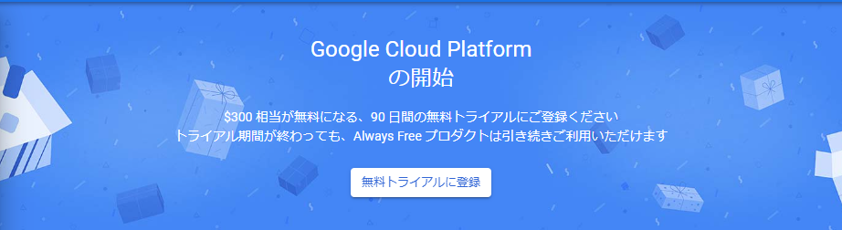

初めて利用する場合、『無料トライアルに登録』があるので適宜フォームを入力してトライアルに登録する。

クレジットカードの登録があるけど無料枠利用中に請求は来ないし、無料枠が終わっても自動で支払いが進められたりもしないのでご心配なく。

「ようこそ」と言われたら OK 。

## インスタンスの作成

サイドバーの Compute Engine > VM インスタンスから課金を有効にする(時間がかかる場合あり)。

https://console.cloud.google.com/compute/instances

作成をクリックしてインスタンスの設定に移る。

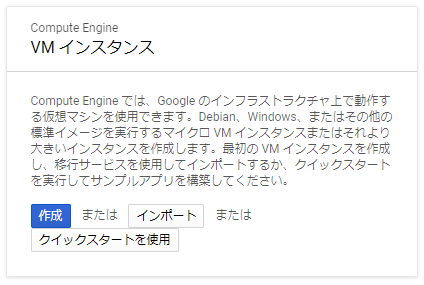

新規 VM インスタンスから、以下のように設定。


|                  |                        |                                                           |
|------------------|------------------------|-----------------------------------------------------------|
| 名前             | csgo-server            |                                                           |
| リージョン       | asia-northeast1 (東京) | プレイする地域から近ければどこでも OK                     |
| ゾーン           | asia-northeast1-b      | ゾーンによってスペックが変わったりするけど多分どこでも OK |
| マシンファミリー | 汎用                   |                                                           |
| シリーズ         | E2                     |                                                           |
| マシンタイプ     | e2-standard-4          | 一人で練習したりするだけなら e2-standard-2 でも可         |

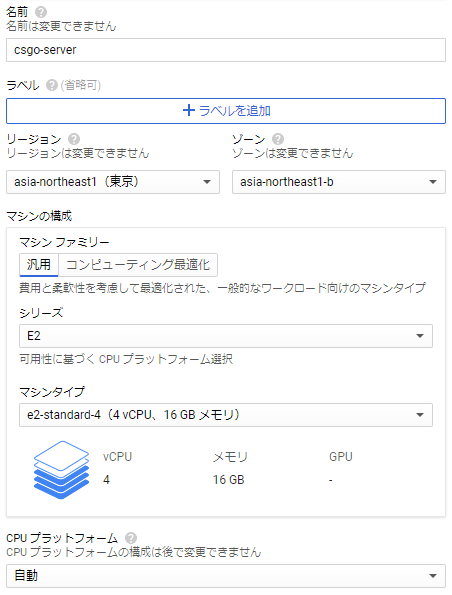

ブートディスク > 変更をクリック。

以下のように設定。

ディスクサイズは大量に mod を入れることを考えなければ 50GB で十分。

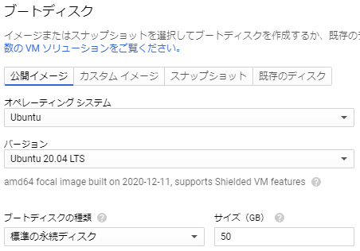

作成をクリック。

## ネットワークの設定

### IP アドレスの設定

作成した VM インスタンスのネットワークインタフェースの詳細を表示。

ネットワークインタフェースの詳細にあるプライマリ内部 IP をメモしておく。

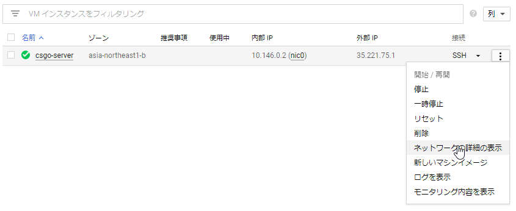

左側のタブの外部 IP アドレスから静的アドレスの予約へ進み以下のように設定し作成。

リージョンはインスタンス作成時と同じものに設定する(そうしないと接続先が出てこないはず)。

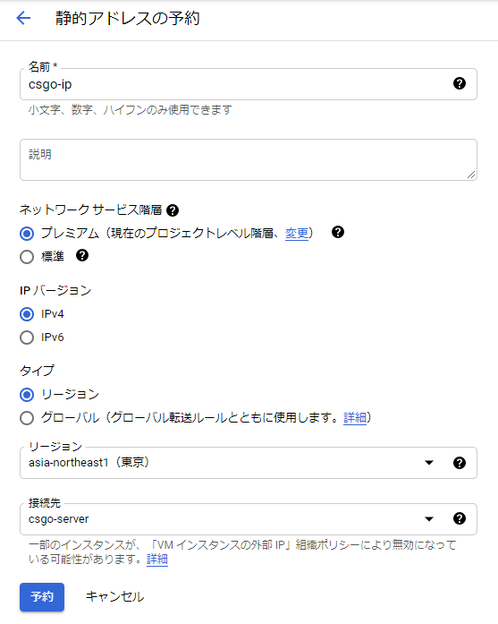

作成後、外部アドレスをメモしておく。

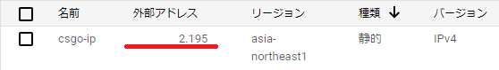

### ファイアウォールの設定

左側のタブからファイアウォール > ファイアウォールの作成をクリック。

名前を `csgo-firewall` とし、以下のように設定。それ以外はそのまま。

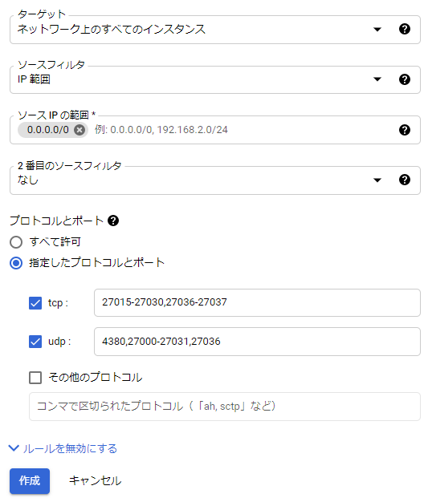

作成をクリック。

## サーバー設定

[VM インスタンス一覧](https://console.cloud.google.com/compute/instances)へ戻り、 `csgo-server` の SSH をクリック。

ポップアップで以下のようなターミナルが立ち上がっていれば OK 。

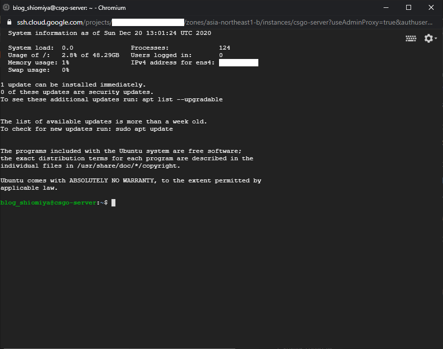

ターミナル画面に以下をコピー&ペーストして実行(Enter)。そこそこ時間がかかる。

```sh
sudo -- sh -c 'dpkg --add-architecture i386; add-apt-repository multiverse; apt-get update; apt-get -y dist-upgrade'
```

終わり次第以下を実行。すぐ終わる。

```sh
wget -O linuxgsm.sh https://linuxgsm.sh && chmod +x linuxgsm.sh && bash linuxgsm.sh csgoserver
```

終わったら `./csgoserver install` を実行。CSGO 自体のインストールが走るのでかなり時間がかかる。おやつでも食べながら待つ。

### CSGO サーバー設定

[Steam ゲームサーバーのアカウント管理](https://steamcommunity.com/dev/managegameservers)で新規ゲームサーバーアカウントの作成から App ID に `730` を設定して作成し、ログイントークンをメモしておく。

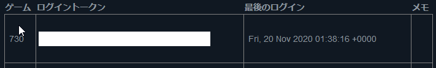

以下のコードの `[YOUR_TOKEN]` と `[YOUR_INTERNAL_IP]` を途中でメモしたログイントークンと内部 IP で置き換えて実行する。

```sh
echo "screen serverfiles/srcds_run -game csgo -usercon -strictportbind -ip [YOUR_INTERNAL_IP] -port 27015 +clientport 27005 +tv_port 27020 +sv_setsteamaccount [YOUR_TOKEN] -tickrate 128 +map de_mirage +servercfgfile server.cfg -maxplayers_override 16 +mapgroup mg_active +game_type 0 +game_mode 1 +host_workshop_collection +workshop_start_map -authkey -nobreakpad" > start.sh
```

さらに CSGO のサーバー設定ファイルを追加するため以下を実行。

`rcon_password` と `sv_password` は適宜好きな文字列に置き換えてください。

```sh
cat <<EOF > serverfiles/csgo/cfg/autoexec.cfg
hostname "CSGO Server"
rcon_password "YOUR_RCON_PASSWORD"
sv_password "SERVER_PASSWORD"
sv_cheats 0
sv_lan 0
exec banned_user.cfg
exec banned_ip.cfg
sv_minupdaterate 128
sv_mincmdrate 128
exec gamemode_competitive
EOF
```

`sh start.sh` でサーバーを起動。

`Connection to Steam servers successful. Public IP is ...` と表示されたら CSGO のサーバーは起動している。

CSGO を起動してコンソールに `connect [YOUR_EXTERNAL_IP]:27015; password [SERVER_PASSWORD]` と打ち込んで接続を確認する。

サーバーを閉じる際には SSH サーバー側で `quit` と打ち込んで Enter すれば閉じられる。

## addons/mods のインストール

ここまでで CSGO のサーバーは立ち上がっているので接続はできますが、投げ物練習にしろ紅白にしろ自前でセットアップするのはそこそこ手間がかかる。

今回導入した方法では便利なコマンドが付いてるのでそれを使ってセットアップする。

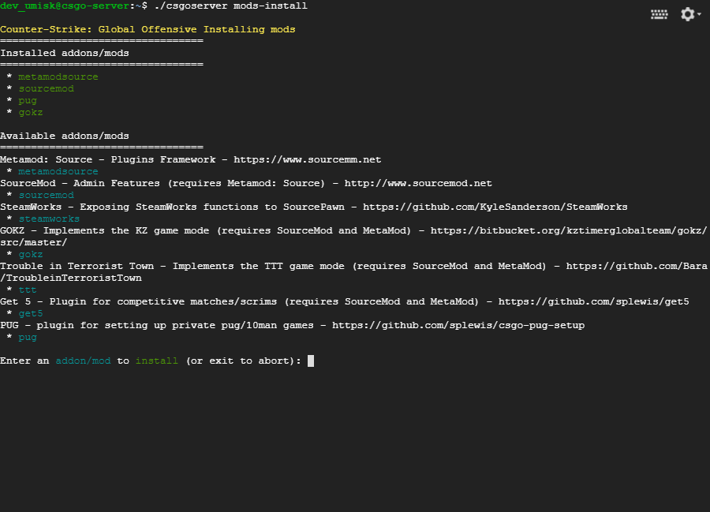

一旦 CSGO サーバーをターミナルから `quit` と打ち込み停止させてから `./csgoserver mod-install` を実行。

以下 2 つをインストール(`./csgoserver mod-install` を 2 回実行することになる)。

- metamodsource
- sourcemod

### 紅白設定の適用

再び `./csgoserver mod-install` を実行し、 `pug` を選択しインストール。

インストール後 `sh start.sh` から再びサーバーを起動して接続すると、チャットコマンド `.setup` から紅白のセットアップが行える。

### Practice-Mode の適用

投げ物練習等に使えるプラグインのインストール。

以下から `practicemode_x.x.x.zip` をダウンロード。

https://github.com/splewis/csgo-practice-mode/releases

ターミナル右上の歯車をクリックして Upload file から、ダウンロードした zip をアップロード。

ターミナル上で `tar xvzf [FILE_NAME] -C serverfiles/csgo/` を実行(`[FILE_NAME]` はダウンロードした zip ファイル名で置き換える)。

インストール後 `sh start.sh` から再びサーバーを起動して接続すると、チャットコマンド `.setup` から practice mode へ切り替えることができる。

## インスタンスの停止

無駄使いを避けるため、使用しないときにはインスタンスを停止させておく。

CGP コンソールの VM インスタンスから `csgo-server` を停止。

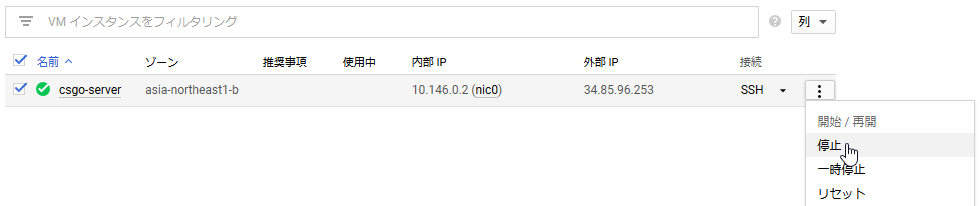

---

やや手間は必要ですが、無料で CSGO のサーバーを建てる方法を紹介しました。

普通に借りようとするとだいたい月額  800 円くらいはかかるので、少しは節約できる。

なお 2020/12/21 現在、 Project Hypnos が再稼働しているので、紅白サーバーを立てるならそれを使ったほうが間違いなく楽だし早い。




