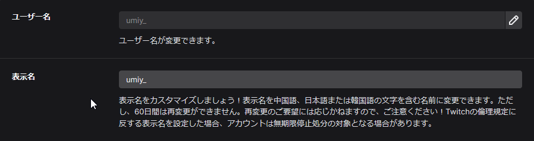

Twitch のユーザー名・表示名の変更はプロフィール設定から行える。

[https://www.twitch.tv/settings/profile](https://www.twitch.tv/settings/profile)
 

Twitch の表示名は中国語・日本語・韓国語に設定した場合再設定ができないよう (英語に設定した場合はできるかも) 。  

応急処置として、Twitch の表示名の欄にユーザー名と同じ値を入れると表示名は非表示 (同じなので表示されない) になる。
 

 
ユーザー名は 3 ヶ月に一回変更できるので、一度表示名を設定してしまっても一応変更は効く。
