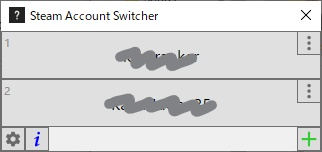

+++
date = "2020-02-01 14:30:04 +0000 UTC"
draft = false
title = "Steamアカウントをワンクリックで切り替える"
tags = ["game","tool"]

+++

## 導入

<a href="https://github.com/danielchalmers/SteamAccountSwitcher/releases">Releaseタブ</a>から最新版の <code>Setup.exe</code> か <code>Source Code (zip)</code> を拾ってインストール.

タスクバーの検索窓から <code>SteamAccountSwicher</code> すれば出てくるので<a href="https://github.com/danielchalmers/SteamAccountSwitcher/blob/master/README.md">ここ</a>を参考に (しなくてもidとpswd入れるだけ) セットアップしてタスクバーなりデスクトップなりにショートカットを配置しておく.

使いたいときには立ち上げて使いたいアカウントをポチるだけ.

二段階認証は手でやる.

最低限の機能だけなので使いやすい.

