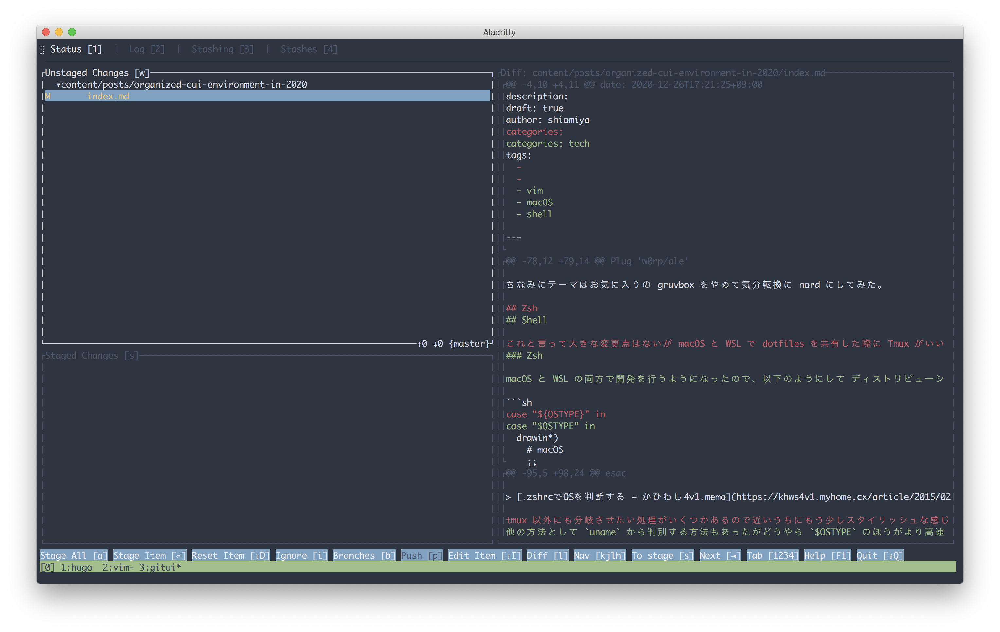

2020 年も終わりそうなので Vim や Shell 周りの CUI 開発環境を断捨離したのでその記録。

## Vim

### .vimrc

これまで言語ごとのインデントは全部手動で以下のように設定していた。

```viml
augroup fileTypeIndent
  autocmd!
  autocmd BufNewFile,BufRead *.c setlocal tabstop=4 shiftwidth=4
  autocmd BufNewFile,BufRead *.cpp setlocal tabstop=4 shiftwidth=4
  autocmd BufNewFile,BufRead *.py setlocal tabstop=4 shiftwidth=4
  autocmd BufNewFile,BufRead *.rs setlocal tabstop=4 shiftwidth=4
  autocmd BufNewFile,BufRead *.java setlocal tabstop=4 shiftwidth=4
  autocmd BufNewFile,BufRead *.elm setlocal tabstop=4 shiftwidth=4
  ...
augroup END
```

このままだと永遠に増え続けそうだったのでプラグインを導入した ([sheerun/vim-polyglot](https://github.com/sheerun/vim-polyglot)) 。

### プラグイン

プラグインマネージャーは導入が楽なので vim-plug を継続して使う。

```diff
- Plug 'tomasr/molokai' " theme
- Plug 'micha/vim-colors-solarized' "theme
- Plug 'morhetz/gruvbox' " theme
+ Plug 'arcticicestudio/nord-vim' " theme
Plug 'airblade/vim-gitgutter'
Plug 'sheerun/vim-polyglot'
Plug 'cohama/lexima.vim'
Plug 'rust-lang/rust.vim'
Plug 'racer-rust/vim-racer'
- Plug 'ElmCast/elm-vim'
- Plug 'mattn/sonictemplate-vim'
Plug 'wakatime/vim-wakatime'
Plug 'hugolgst/vimsence'
Plug 'itchyny/lightline.vim'
- Plug 'yuttie/comfortable-motion.vim'
- Plug 'justinmk/vim-dirvish'
- Plug 'prabirshrestha/async.vim'
Plug 'prabirshrestha/vim-lsp'
+ Plug 'mattn/vim-lsp-settings'
Plug 'prabirshrestha/asyncomplete.vim'
Plug 'prabirshrestha/asyncomplete-lsp.vim'
- Plug 'ryanolsonx/vim-lsp-javascript'
- Plug 'ryanolsonx/vim-lsp-python'
- Plug 'ryanolsonx/vim-lsp-typescript'
Plug 'w0rp/ale'
- Plug 'ianding1/leetcode.vim'
- Plug 'mattn/emmet-vim'
```

もともとあまりプラグインが入っていなかったけど更に減らした。

`vim-lsp-**` を LSP を使うために導入していたが、 [mattn/vim-lsp-settings](https://github.com/mattn/vim-lsp-settings) を導入して超すっきりした (そのために [`lspconf.vim`](https://github.com/shiomiyan/.dotfiles/blob/master/.vim/userautoload/lspconf.vim) を作って `.vimrc` の肥大化を抑えていたがこれも要らなくなった) 。

ファイラはシンプルかつ軽量な dirvish を使っていたけど、標準の netrw で十分そうなのでこれも消した。

その他使用頻度の少なかったプラグインを削除した。

ちなみにテーマはお気に入りの gruvbox をやめて気分転換に nord にしてみた。

## Shell

### Zsh

macOS と WSL の両方で開発を行うようになったので、以下のようにしてディストリビューション別に処理を分けるようにした。

```sh
case "$OSTYPE" in
  drawin*)
    # macOS
    ;;
  linux*)
    # Linux
    ;;
esac
```

> [.zshrcでOSを判断する – かひわし4v1.memo](https://khws4v1.myhome.cx/article/2015/02/zshrc%E3%81%A7os%E3%82%92%E5%88%A4%E6%96%AD%E3%81%99%E3%82%8B/)

他の方法として `uname` から判別する方法もあったがどうやら `$OSTYPE` のほうがより高速らしい。

zshrc の肥大化防止の為に今のうちからファイルを分割することにしたので、以下のような構成になった。

```
├── .zsh
│  ├── aliases.zsh
│  ├── exports.zsh
│  └── tmux.zsh
├── .zprofile
├── .zshenv
├── .zshrc
```

これで後々記述量が増えてもある程度見通しが良くなりそう。

### Git

tig と Git command を併用してたけど、 Rust 製ツール探していたら見つけた gitui に乗り換えてみた。キーコンフィグも Vim に変更してファーストインプレッションはいい感じなのでしばらくこれを使う。





## その他ツール

### ウィンドウマネージャー

初の WM に [yabai](https://github.com/koekeishiya/yabai) を導入してみた。

一旦ゆるく導入したい + Karabiner との干渉がちょっと怖いのとで skhd は後ほど入れることにした。

まだ ignore の設定と細かい設定を済ませていないので、勝手に 1:1 になってくれたり画面いっぱいになってくれたりするくらいしか恩恵を受けていない。

### ブラウザ

Firefox + DuckDuckGo のプライバシーに配慮した構成にした。DuckDuckGo にしてから検索結果に個人ブログがたくさん出てくるようになってネットサーフィンが楽しくなった。あと Bang! が意外と便利。

## おわりに

極力 Linux 、 macOS 、 Windows(WSL) 間でシームレスに設定を共有できるようにしておきたいのだがなかなか難しい。

dotfiles 群をそこそこ整理できたのは結構気に入っている。そのうち CI を導入してディストリビューションごとに設定が通ることを保証できるようにしたい。
