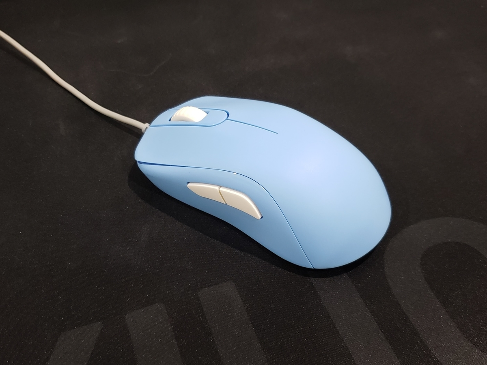

+++
date = "2020-02-26 07:07:07 +0000 UTC"
draft = false
title = "S2 DIVINA のコーティング削り"
tags = ["gadget"]

+++

昨年3月にArkのオンラインストアで S2 divina を買ってから1年間、使い続けてきた。

形サイズはすごく良いのだけど人一倍手汗をかく僕にとって、このクリアコーティングはどうもだめだったので、削った。

## 作業

### 用意したもの

<ul>
<li><a href="https://www.amazon.co.jp/gp/product/B082X71N6H/ref=ppx_yo_dt_b_asin_title_o04_s00?ie=UTF8&amp;psc=1">サンドペーパー</a></li>
<li>精密ドライバー</li>
</ul>

サンドペーパーは何があっても良いようにいろんな粗さが入っているのを選んだ。結局使ったのは600番だけ。
スポンジ付きはこういう作業が苦手な人は使っても良いかも。

### 削る

600番で削ればそこそこ滑らかかつ手汗に強い感じに仕上がります。

あと削りすぎ注意。

