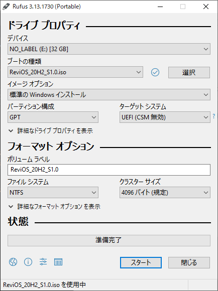
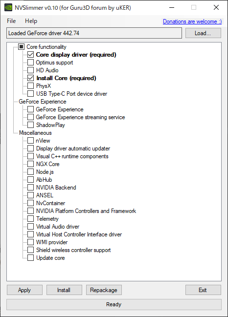

+++
date = "2020-12-06 20:49:59 +0000 UTC"
draft = false
title = "超軽量版 Windows10 こと ReviOS のすゝめ "
tags = ["tweak","memo","game"]

+++
海外の OS Tweaking Community (?) でぼちぼち話題っぽい RevisionOS (ReviOS) を使ってみたので導入手順とレビューをかんたんに書きます。

おそらく主にゲーマー向けで、Windows10 の不要な機能やプロセスを削ぎ落としているので、低遅延かつ高フレームレートが期待できます。

現在使用しているディスクへのインストールを行う場合はすべて初期化されるので、バックアップ等適宜取り導入は自己責任でお願いします。

<ul class="table-of-contents">
    <li><a href="#ReviOS-とは">ReviOS とは</a></li>
    <li><a href="#ReviOS-導入ガイド">ReviOS 導入ガイド</a><ul>
            <li><a href="#ISO-ダウンロード">ISO ダウンロード</a></li>
            <li><a href="#Bootable-USB-の作成">Bootable USB の作成</a><ul>
                    <li><a href="#パーティション構成について">パーティション構成について</a></li>
                </ul>
            </li>
            <li><a href="#ディスクへの書き込み">ディスクへの書き込み</a></li>
        </ul>
    </li>
    <li><a href="#インストール後にやること-やったこと">インストール後にやること (やったこと)</a><ul>
            <li><a href="#表示言語の変更">表示言語の変更</a></li>
            <li><a href="#日本語-IME-導入">日本語 IME 導入</a></li>
            <li><a href="#Nvidia-GPU-ドライバのインストール">Nvidia GPU ドライバのインストール</a></li>
            <li><a href="#Visual-C-Runtime-のインストール">Visual C++ Runtime のインストール</a></li>
        </ul>
    </li>
</ul>

## ReviOS とは

[Revision](https://www.revi.cc/)

>ReviOS aspires to re-create what Windows as an operating system should have been, with a particular emphasis on performance, stability and privacy.

とのことで、パフォーマンスやプライバシー保護に重点を置いて最適化された Windows10 ベースのカスタム OS らしい。

## ReviOS 導入ガイド

サブ PC 等あれば問題ありませんが、メイン PC へのインストールを考えているのであれば、プロダクトキーの移行作業を行うこと。新たに購入する予定なら不要。本筋からはそれるので移行方法は割愛。調べれば出てくる。

その先はとりあえず USB 一本あれば作業を進められるので USB だけ握りしめて読んでください。

一応 Youtube にインストールガイドがあるので見ながらやれば簡単。本記事もほとんど動画をなぞるだけです。

<s><a href="https://youtu.be/eNEIqFy2ftM/">https://youtu.be/eNEIqFy2ftM/</a><cite class="hatena-citation"><a href="https://youtu.be/eNEIqFy2ftM/">youtu.be</a></cite></s> 非公開になってました。

### ISO ダウンロード

<a href="https://www.revi.cc/revios/download">公式サイトの Download</a> から好きなバージョンの ISO をダウンロードする。

ただ 2020/12/4 現在、ここからダウンロードできるものの中で日本語 IME (Google 日本語入力) が僕の PC で正常に動作したものは <strong>20H2 S1.0</strong>、 <strong>2004S1.0</strong> の2つのみだったので、この2つのどちらかになりそうです。

<a href="https://www.revi.cc/revios/changelog">Changelog</a> に

>FIXED: Input Method Editor for Asian languages

とは書いてあったけど Microsoft の IME は機能しなくて、結局 Google 日本語入力を入れる必要があったのはちょっと不満。Asian Languages とは一体。

### Bootable USB の作成

動画でも使っている Rufus が一番ラクです。多分。
使い慣れているものがあればそれを使ってください。

<a href="https://rufus.ie/">Rufus - The Official Website (Download, New Releases)</a>

ここからダウンロード。そんなに頻繁に使うものでもないので Portable 版で十分です。

画像のように設定。

#### パーティション構成について

<ol>
<li>Win + R でファイル名を指定して実行から、<code>DISKMGMT.MSC</code> を実行。</li>
<li>インストールを考えているドライブを右クリックしてプロパティを開く。</li>
<li>ボリュームタブのパーティションのスタイルを参考に設定。</li>
</ol>

スタートを押して少し待てば完了。

### ディスクへの書き込み

スクリーンショットがないので割愛。

念の為書き込みを考えているドライブ以外をすべて外してから、パーティションをすべて削除。 (Unlocated Space 一つになるはず)

※ 後日追記予定

インストールが終わるといつものように Windows のユーザー名とパスワードを設定するように促されるので、特に困ることはないはず。

一度再起動がかかる場合がある (僕は入った) ので、焦らずゆっくり待ちます。

## インストール後にやること (やったこと)

ここからは僕が勝手にやったことなので好きなところだけ汲み取ってやるもよし終わるもよし。

### 表示言語の変更

設定 > 時刻と言語 > 言語 > 言語の追加 から日本語をインストール。

手書きと音声認識はいらなさそうだったので外してダウンロード。

優先する言語で日本語を最上位に。

### 日本語 IME 導入

<code>FIXED: Input Method Editor for Asian languages</code> のハズが日本語はどうやら打てなかったので、 Google 日本語入力をインストールします。

<a href="https://www.google.co.jp/ime/">Google 日本語入力 – Google</a>

インストールウィザードにしたがってインストール後、 設定 > 時刻と言語 > 言語 > 日本語 > オプション から、キーボードの追加で Google 日本語入力を追加。

ここまでで日本語入力は問題なく行える (ハズ) 。

### Nvidia GPU ドライバのインストール

この辺から公式サイトの Post-Install とかぶることが多いので、詳しくはそちらで。

NVCleanInstall か NVSlimmer か、みたいな感じらしいですが、個人的にわかりやすかった NVSlimmer を推します。

<a href="https://www.guru3d.com/files-get/nvidia-driver-slimming-utility,2.html">NVIDIA driver slimming utility v0.10 Download</a>

<a href="https://www.nvidia.com/download/driverResults.aspx/158756/en-us">NVIDIA DRIVERS GeForce Game Ready Driver WHQL</a>

上記サイトから NVSlimmer とドライバをインストール。ドライバのバージョンについては何でもいいのですが、442.74 が最もいいという話はここだけでされているわけでもないので 442.74 で。

ダウンロードした zip を解答して出てきた NVSlimmer.exe を起動。

ドライバの選択を促されるので、インストールしたドライバ (ex. <code>442.74-desktop-win10-64bit-international-whql.exe</code> ) を選択。

ドライバのロードが終了するとチェック項目が出てくるので、特に必要なものがなければ画像のようにチェック。

もし Geforce Experience が必要であれば、 Geforce Experience ツリー下のチェック項目はすべてチェックしてください。多分しないとインストールでコケるので。加えて、インストール後に Geforce Experience 側の設定でドライバの自動アップデート設定を切ることをおすすめします。

問題なければ Apply > Install 。通常のドライバインストールと同様にウィザードが走ると思います。カスタムではなく推奨で通り向ければおそらくOK。

これでドライバのインストールは終了。

### Visual C++ Runtime のインストール

大体のゲームに必要なのでインストール。

<a href="https://sites.google.com/view/meetrevision/revios/post-install#h.p_-aHIalM_nOwU">Revision - Post-Install</a>

Revision Post-Install を参考にインストール。 Method1 が楽なのでおすすめ。

大体ここまでやれば問題なく動くはずです。

あとは適宜 Discord なり Steam なり入れて快適なゲーム環境を楽しんでください。

再起動時やタスクマネージャーを開くとわかりますがバックグラウンドプロセスが少ないせいか起動にかかる時間とかは超爆速。

ゲームのフレームレートも今の所安定しています。

最後に、更に PC を最適化したい気持ちがあれば <a href="https://sites.google.com/view/winshit/guides#h.jiz8ksycd9uz">RevisionOS モデレーターが書いた記事</a> を参考に弄ってみてもいいと思います。

反響があればもう少し丁寧に書きます。以上。

参考 
<a href="https://sites.google.com/view/meetrevision/revios/post-install">https://sites.google.com/view/meetrevision/revios/post-install</a>

<a href="https://sites.google.com/view/winshit/guides">https://sites.google.com/view/winshit/guides</a>

<a href="https://docs.google.com/document/d/1_DwK2rn-nqox7cnbHfL7AzUjckUyvAIBzkTRFFLD3NQ">https://docs.google.com/document/d/1_DwK2rn-nqox7cnbHfL7AzUjckUyvAIBzkTRFFLD3NQ</a>

