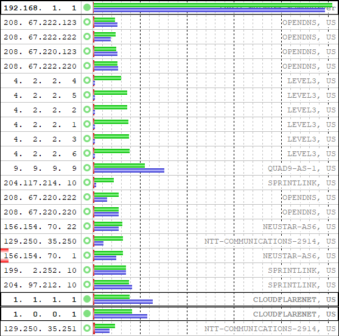
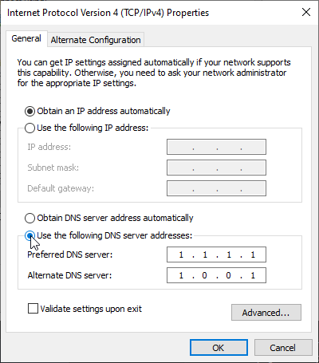

Discord で相手方の声が頻繁に飛ぶので解決策を模索していたところ、 パブリック DNS を設定したところだいぶ落ち着いたのでご紹介。

Twitch や YouTube で生放送を見ているときにバッファリングが頻発していたのもこれを設定したら改善された。

## DNS サーバーを探す

Google や Cludflare、 OpenDNS が結構メジャーだったりするが、一応 DNS Benchmark を使って自分にあったものを探してみる。以下からダウンロード。

https://www.grc.com/dns/benchmark

Nameservers > Run Benchmark からベンチマークを実行。終了するとポップアップが表示されるので Not now を押して結果を確認する。

せっかちな人のための候補としては以下。

<table>
  <tr>
    <td>Google</td>
    <td><code>8.8.8.8</code> <code>8.8.4.4</code></td>
  </tr>
  <tr>
    <td>Cloudflare</td>
    <td><code>1.1.1.1</code> <code>1.0.0.1</code></td>
  </tr>
  <tr>
    <td>Level3</td>
    <td><code>4.2.2.5</code> <code>4.2.2.6</code></td>
  </tr>
</table>

脱 Google を勧めている最中なのでネームバリューとかも考えて [Cloudflare](https://1.1.1.1/dns/) にした。

## DNS サーバーの設定

Win + R > `ncpa.cpl` を実行。

利用しているネットワークアダプタを右クリック > プロパティを開く。

Internet Protocol Version 4 (TCP/IPv4) を選択して「次の DNS サーバーのアドレスを使う」を選択して、お気に入りの DNS サーバーを入力して OK で終わる。

## おわりに

回線速度は出ているはずなのに同じ症状の人は試してみてもいいかも。

_追記 (2020/01/15): めちゃくちゃ改善した_

## 参考

- https://blog.cloudflare.com/announcing-1111/
- https://labs.apnic.net/?p=1127
