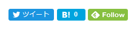

Hugo で生成したこのブログには、もともと下のような公式で公開されているシェアボタンを配置していたが、なんとなく統一感に欠けているような気がしていた。



せっかくなので、 [Shields.io](https://shields.io/) の Dynamic で生成したバッジに変更してみた。

できたものは最下部にある ↓ 。

## Twitter

Shields.io で Twitter をサポートしているのでやるだけ。

```html
<a href="http://twitter.com/intent/tweet?url={{ .Permalink }}&text={{ .Title }}%20%7C" target="blank">
  
</a>
```

## はてなブックマーク

はてなブックマーク件数取得 API を利用する。

- http://developer.hatena.ne.jp/ja/documents/bookmark/apis/getcount

複数 URL 版を利用しないと Json ではなく text/plain を返してしまうので注意。

```html
<a href="http://b.hatena.ne.jp/add?mode=confirm&url={{ .Permalink }}&title={{ .Title }}" target='blank'>
  
</a>
```

## Feedly

Feeds API を利用する。

- https://developer.feedly.com/v3/feeds/#get-the-metadata-about-a-specific-feed

Hugo の `.Site.RSSLink` を使いたかったけど URL エンコードの関係か、うまくいかなかった。

```html
<a href='https://feedly.com/i/subscription/feed/https://www.shiomiya.com/index.xml'  target='blank'>
  
</a>
```

## アイコン

[simpleicons.org](https://simpleicons.org/) から探して使う。失礼ながらまさかはてながあるとは思っていなかった。

## 参考

- [Shields.ioと各種APIで独自のバッジを作って遊ぶ - Qiita](https://qiita.com/ota-meshi/items/4799f490ecc8c8cf642)
