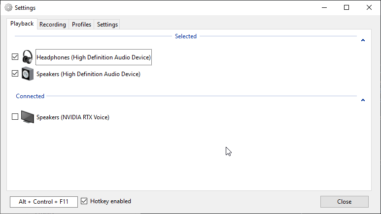
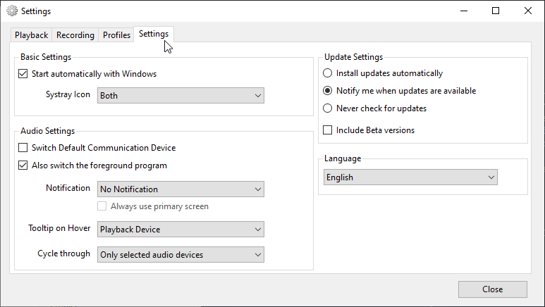

スピーカーとイヤホン・ヘッドホンを併用していると、一々タスクバーのサウンド切り替えを触ることすら煩わしくなってきたので少し便利なツールの紹介。



おおよそ以下のようになっていて、選択した再生デバイスをホットキーでトグルできるようになる。

Basic Settings の Systray Icon を Both に設定しておくとタスクバーに現在の再生デバイスがアイコンで表示されてわかりやすい。

