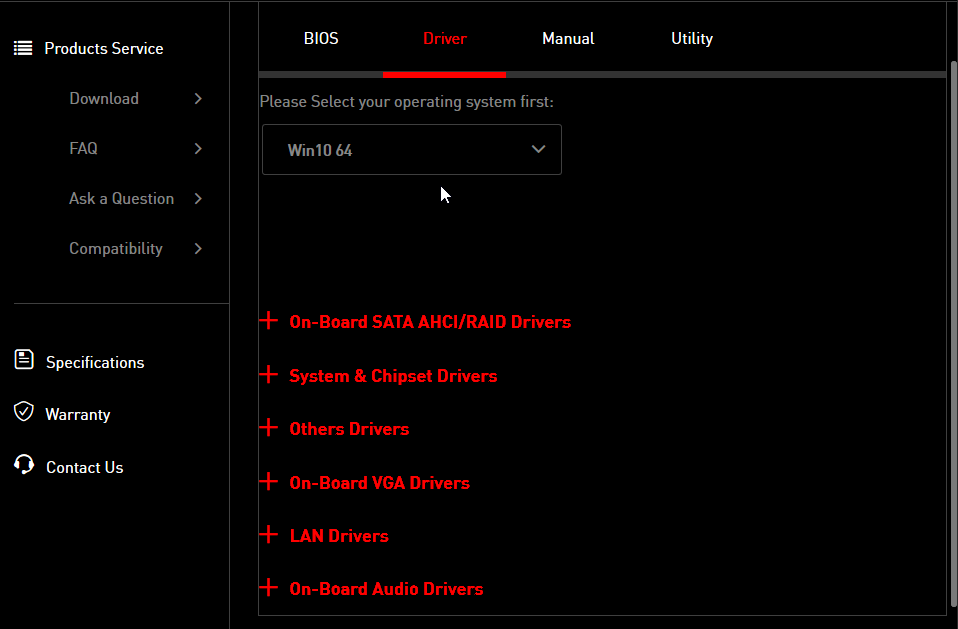

OS クリーンインストールを頻繁にやるようになったので毎回やってることを書き留めておく。

## 前準備

OS クリーンインストールを行うまえに、クリーンインストール後に必要になるものはドライバ含め全てインストールしておく。

自分の場合、

```
.
├── 1 - install chipset and audio drivers
│  ├── intel_chipset_9.zip
│  └── realtek_creative_audio.zip
├── 2 - install GPU driver
│  ├── 442.74-desktop-win10-64bit-international-whql.exe
│  └── [Guru3D.com]-NVSlimmer.zip
├── 3 - install runtimes
│  ├── dxwebsetup.exe
│  └── Visual-C-Runtimes-All-in-One-Aug-2020.zip
├── 4 - windows optimization
│  └── Windows Intel.zip (Optimization tools)
├── 5 - install basic programs
│  ├── 1PasswordSetup-7.6.785.exe
│  ├── 7z1900-x64.msi
│  ├── Avidemux_2.7.6VC++64bits.exe
│  ├── DiscordSetup.exe
│  ├── FACEITInstaller_64.exe
│  ├── Firefox Installer.exe
│  ├── GoogleJapaneseInputSetup.exe
│  ├── OBS-Studio-26.0.2-Full-Installer-x64.exe
│  ├── OpenShellSetup_4_4_142.exe
│  ├── osu!install.exe
│  ├── RawAccel_v1.3.0.zip
│  ├── ShareX-13.3.0-setup.exe
│  ├── SlackSetup.exe
│  ├── SoundSwitch_v5.6.1.38743_Release_Installer.exe
│  ├── SpotifySetup.exe
│  ├── SteamSetup.exe
│  ├── vlc-3.0.11-win32.exe
│  └── VSCodeUserSetup-x64-1.51.1.exe
├── 6 - setup program config
│  ├── csgo/
│  ├── kovaak config/
│  ├── obs/
│  ├── openshell/
│  ├── osu!/
│  └── sharex config/
├── buckup
│  └── 20h2s2_default.reg
├── caps2ctrl.reg
└── README.md
```

だいたいこんな感じですべて zip して起動 USB の中に入れておいてます。

## 各種ドライバのダウンロード・インストール

### チップセットドライバとオーディオドライバ

使っているマザボの型番を調べるとドライバが見つかるのでインストール。

自分の場合 Z87 GD65 GAMING というものなので、 `z87 gd65 gaming drivers` とかで調べると出てくる。



たくさん出てくる場合もあるみたいですが、ダウンロードしておくのは

- System & Chipset Drivers
- On-Board Audio Drivers
- LAN Drivers

だけで十分だと思う。

だいたい使うことのない余計なソフトウェアがついてくる時があるので、ダウンロードの段階で Driver Only が選択できるなら選択しておく。

インストールウィザードで除外できるなら除外する。

### GPU ドライバ

Nvidia の GPU ドライバを以下からダウンロード。バージョンは 442.74 。

https://www.nvidia.com/en-us/drivers/results/158759/

でもって、NVSlimmer[^1] もダウンロード。

https://www.guru3d.com/files-get/nvidia-driver-slimming-utility,1.html

required 以外はアンチェックしてインストール。

## ランタイムのダウンロード・インストール

以下 2 つをダウンロード・インストール。

- https://www.microsoft.com/en-us/download/details.aspx?id=35
- https://www.techpowerup.com/download/visual-c-redistributable-runtime-package-all-in-one/
  - `install_all.bat` を実行。

## プログラムのインストール

全てにおいてインストール時にデスクトップショートカットを作成しないようにする。

- 1Password
- 7zip
- Avidemux (動画編集ソフト)
- Discord
- FACEITAC
  - クライアントを除いてインストール
- Firefox
  - https://github.com/spencerwooo/firefox-overlay-scrollbar をインストール後に適用。
- Google 日本語入力
  - インストール後、IME 有効化無効化のキーマップを全て `Ctrl-Space` に変更する。
- OBS
- OpenShell
  - Start Menu のみインストール。それ以外はアンチェック。
- ShareX (スクリーンショットツール)
- Slack
- SoundSwitch
  - https://github.com/Belphemur/SoundSwitch
  - ホットキーでサウンドデバイスを切り替えられるようにするツール。
- Spotify
  - `%USERPROFILE%\AppData\Roaming\Spotify` に移動して、 `prefs` を開き `storage.size=1024` の一行を追記。
- Steam
- VLC (動画プレイヤー)
- VSCode

## プログラムごとの設定

初期化前に設定をエクスポートできるものは全てしておく。

自分の場合は主に以下。

- CS:GO
  - `autoexec.cfg`
  - `config.cfg`
  - `video.txt`
  - フォントとフォントマネージャー
- kovaak
  - `palette.ini`
  - `weaponsettings.ini`
- OBS
- OpenShell
- Osu!
- ShareX

保存されているパスも確認しておくとなお楽。

## 細かい最適化

- https://sites.google.com/view/winshit/guides
- https://github.com/djdallmann/GamingPCSetup
- https://github.com/BoringBoredom/PC-Optimization-Hub

あとこれも

- https://www.shiomiya.com/caps-to-ctrl/

[^1]: Nvidia GPU Driver を最適化するツール。
