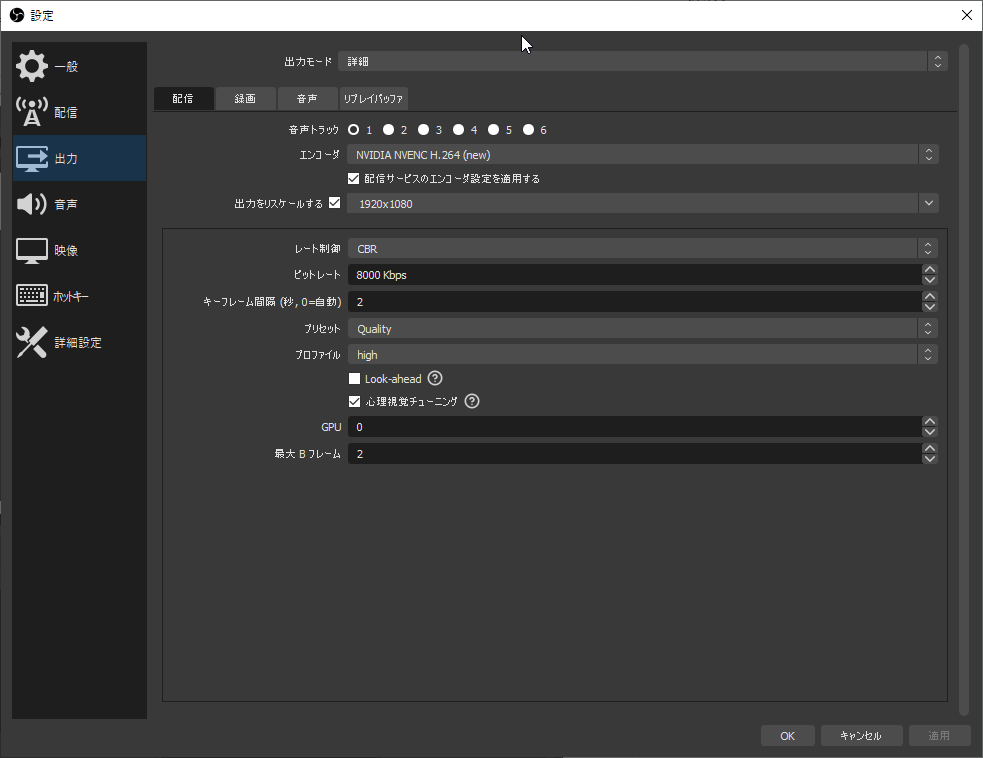
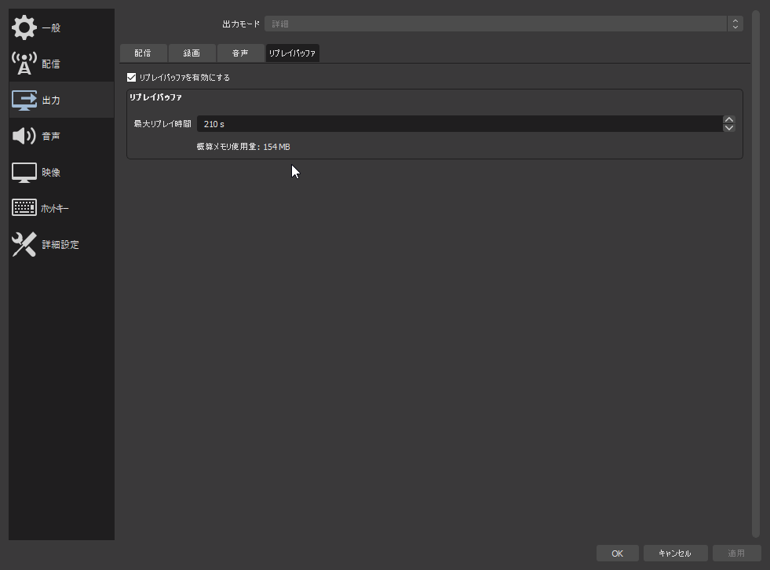
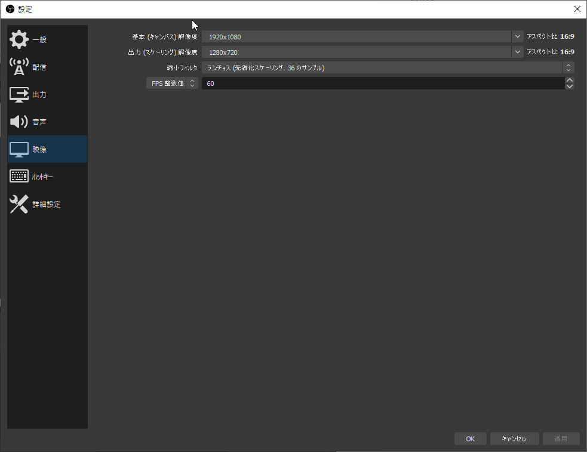
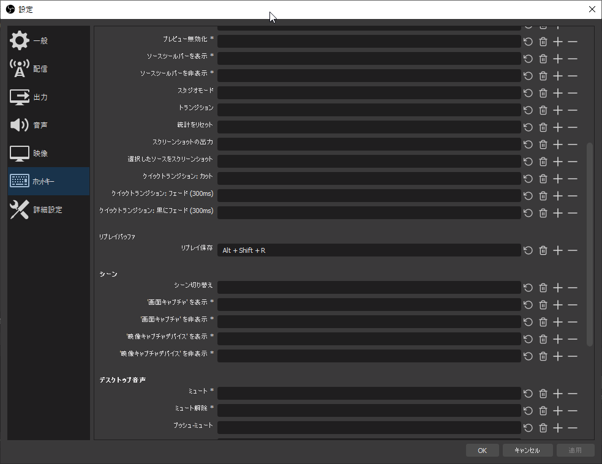
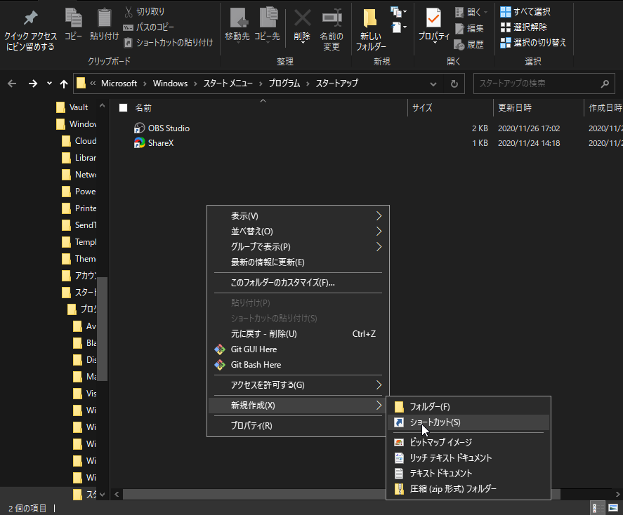
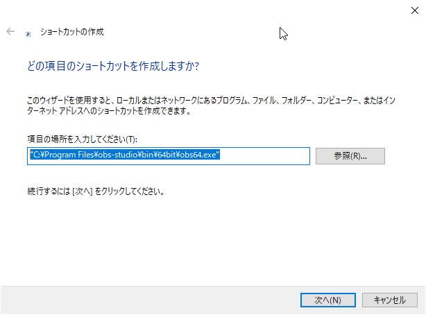
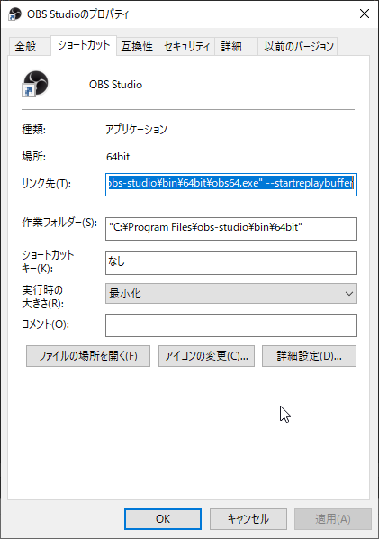

+++
date = "2020-11-26 17:47:28 +0000 UTC"
draft = false
title = "OBS Replay Buffer を instant replay のように使う"
categories = ["software"]
tags = ["obs","Instant replay"]
+++

OBS Replay Buffer を Geforce Experience の instant replay のように使う方法。

(Windows10, i7 4790, GTX980Ti)

### OBS のインストール

[Download | OBS](https://obsproject.com/download)

### OBS の設定

PC スペックに合わせてエンコード設定

※ Youtube に Flag movie としてあげたりするのが目的なら出力解像度は FHD 一択。

bitrate の設定は適宜アップロード先の推奨ビットレートを参考にして設定。

[Recommended upload encoding settings - YouTube Help](https://support.google.com/youtube/answer/1722171?hl=en)

ただ、NVENC で動きの早いゲームや色味の強いゲームを録画する際はやや多めに設定しておくときれいに取れる気がします。

好みでホットキーも設定

出力 > 録画 > 録画ファイルのパス を保存したいところに適宜設定 (例: `C:\Users\<username>\Videos`)

### OBS をスタートアップに追加する

Finder で `C:\Users\<username>\AppData\Roaming\Microsoft\Windows\Start Menu\Programs\Startup` へ移動。

右クリック > 新規作成 > ショートカット

項目の場所に `C:\Program Files\obs-studio\bin\64bit\obs64.exe` を指定。任意の名前 (OBS Studio 等) を設定後、完了。

タスクマネージャーのスタートアップ項目に OBS Studio が追加されていることを確認する。

Geforcce Experience の instant replay 同様、PC 起動時に OBS が裏で起動するようになるので、やっておくと便利。

### OBS 起動時に Replay Buffer が自動的にスタートするようにする

`C:\Users\<username>\AppData\Roaming\Microsoft\Windows\Start Menu\Programs\Startup` へ再び移動し、OBS Studio へのショートカットを右クリックしてプロパティを開く。

リンク先の項目が `"C:\Program Files\obs-studio\bin\64bit\obs64.exe" --startreplaybuffer` となるように変更。

実行時の大きさを最小化に設定。

試してないけど、起動オプションに `--minimize-to-tray` もつけておけば多分最小化される。

[Wiki - Launch Parameters | OBS](https://obsproject.com/wiki/Launch-Parameters)

### 最後に

PCを再起動し、OBS Replay Buffer が走っていることを確認して終了。

次回以降は OBS が自動で起動します。 もしオフにしたい場合はタスクマネージャーのスタートアップ項目から OBS を右クリックして無効化すれば OK 。

ついでに コントロールパネル プログラム > プログラムと機能 から、忌まわしき Geforce Experience を探してアンインストール。

しばらくこれで使ってますが、特に FPS が安定しないとか GPU 使用率が跳ね上がったとかは多分ないです。快適。

強いて言うなら、プログラムごとにクリップがフォルダリングされないことがちょっと不満。

### おまけ

設定 > 一般 > システムトレイ の項目をすべてチェックしておくと、システムトレイに最小化されていい感じ (好み)。

どうせ自動で起動するので、タスクバーでのピン留めは外した。というか、外しておかないと触ったときに多重起動になってしまった事があったので外した。

---

追記

OBS の設定を import して使うこと前提で起動設定を調整して、 `--startreplaybuffer --minimize-to-tray --collection "default" --profile "default" --scene "replay"` のように変更。

理由は PC 初期化後にシーンが勝手に切り替わっていたことがあったから。
