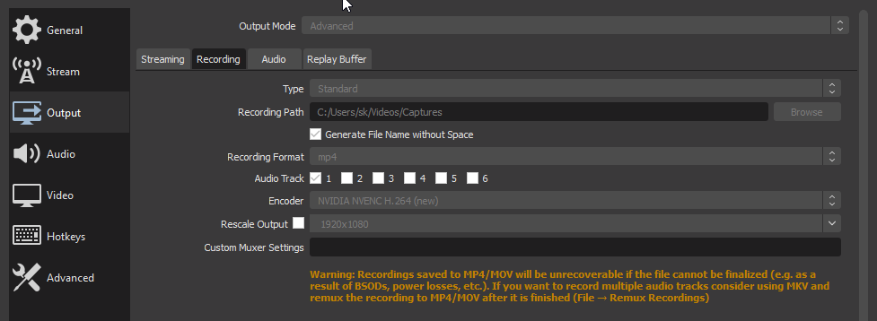

OBS Replay Buffer を Geforce Experience の instant replay のように使う方法。

## OBS のインストール



インストール先のディレクトリを変更していないことを前提に話を進めるので、この辺に詳しくないのであれば設定は変更しないほうが好ましい。

## OBS の設定

基本的な OBS の設定にも触れておく。

### エンコード設定

PC スペックに合わせてエンコード設定する。


※ YouTube に Flag movie としてあげたりするのが目的なら出力解像度は FHD 一択。

ビットレートの設定は適宜アップロード先の推奨ビットレートを参考にして設定。





基本的には公式に則って設定するのが良い。 NVENC で動きの早いゲームや色味の強いゲームを録画する際は、 ビットレートをやや多めに設定しておくときれいに取れる。

### 保存先の設定

出力 > 録画 > 録画ファイルのパスを保存したいところに適宜設定 (例: `C:\Users\<username>\Videos`)



### ホットキーの設定

リプレイを保存ために一々 OBS を触っていては流石に面倒なのでホットキーを設定する。リプレイバッファをオンにしていれば設定のホットキーの項目にリプレイバッファの項目が見えている。


## OBS をスタートアップに追加する

Finder で `C:\Users\<username>\AppData\Roaming\Microsoft\Windows\Start Menu\Programs\Startup` へ移動。

右クリック > 新規作成 > ショートカットから、シートカットを作成する。


項目の場所に `C:\Program Files\obs-studio\bin\64bit\obs64.exe` を指定。任意の名前 (OBS Studio 等) を設定後、完了。


タスクマネージャーのスタートアップ項目に OBS Studio が追加されていることを確認する。

Geforcce Experience の instant replay 同様、PC 起動時に OBS が裏で起動するようになるので、やっておくと便利。

## OBS 起動時に Replay Buffer が自動的にスタートするようにする

`C:\Users\<username>\AppData\Roaming\Microsoft\Windows\Start Menu\Programs\Startup` へ再び移動し、OBS Studio へのショートカットを右クリックしてプロパティを開く。

実行時に自動的にリプレイバッファを起動し最小化するために、リンク先を以下のように変更。

```
"C:\Program Files\obs-studio\bin\64bit\obs64.exe" --startreplaybuffer --minimize-to-tray
```

実行時の大きさを最小化に設定。


他にも役に立つパラメータがあるので一度目を通すと良いと思う。



さらに、 OBS の設定 > 一般 > システムトレイのチェックボックスをすべてチェックする。

## 最後に

PC を再起動し、OBS Replay Buffer が走っていることを確認して終了。

次回以降は OBS が自動で起動します。 もし自動起動をオフにしたい場合はタスクマネージャーのスタートアップ項目から OBS を右クリックして無効化すれば OK 。リプレイバッファ自体を一旦切りたい場合は OBS の配信開始ボタンの周りにリプレイバッファの停止ボタンがあるのでそこから止める。

ついでに コントロールパネル プログラム > プログラムと機能 から、忌まわしき Geforce Experience を探してアンインストール。

しばらくこれで使ってますが、特に FPS が安定しないとか GPU 使用率が跳ね上がったとかは多分ないです。快適。

強いて言うなら、プログラムごとにクリップがフォルダリングされないことがちょっと不満。

---

追記

OBS の設定を import して使うこと前提で起動設定を調整して、 `--startreplaybuffer --minimize-to-tray --collection "default" --profile "default" --scene "replay"` のように変更。

理由は PC 初期化後にシーンが勝手に切り替わっていたことがあったから。
