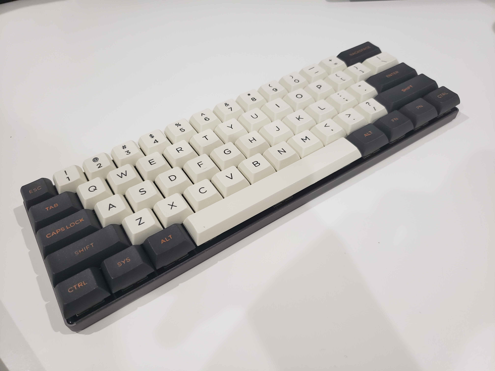
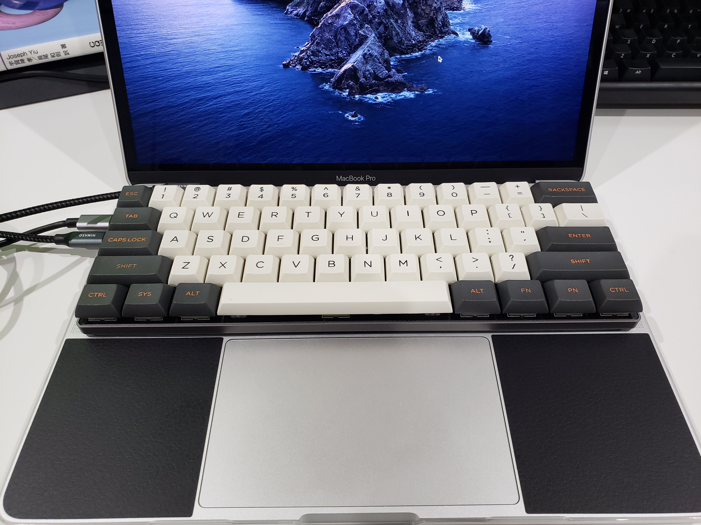
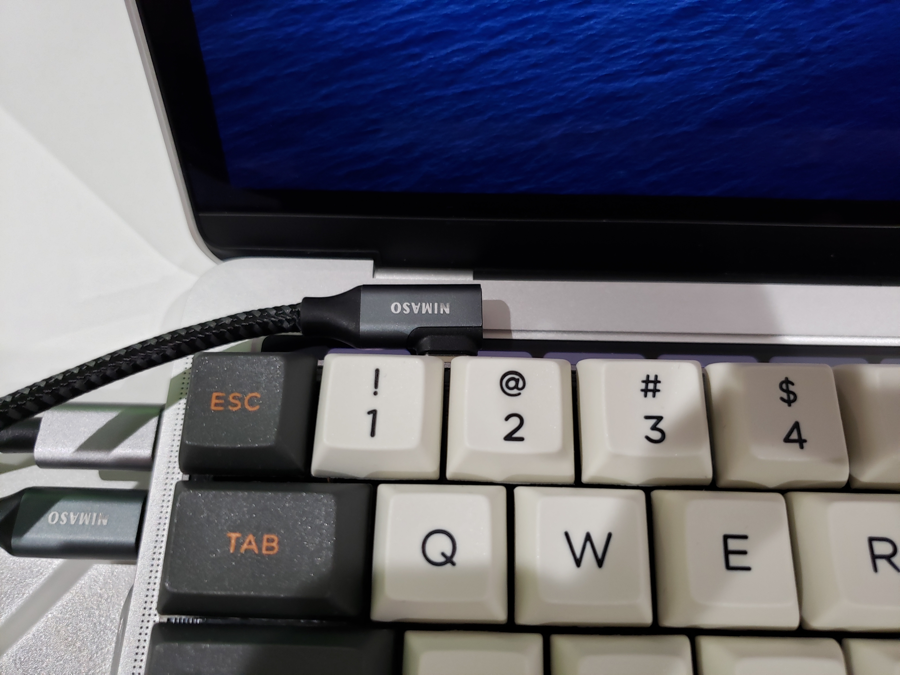

尊師スタイルっぽく使える 60% キーボードが欲しくて買った。

<table>
  <tr>
    <td></td>
    <td></td>
  </tr>
</table>

## レビュー

全体的にかなりフラットな作り。

キー荷重が 45g であることに加えてロープロだからなのか、軽く触っただけでもキーが反応する。体感銀軸とかよりは断然軽い。

打鍵感は赤軸と静電容量を足して2で割った感じに近い気がする。スコスコとカチャカチャの中間くらい。人によっては打ちにくいと感じるかもしれない。

マニュアルは[ここ](https://archisite.co.jp/wp-content/uploads/2020/02/Por3er-V2-Manual-v2.pdf)から閲覧可能。

### いいところ

- マクロ機能が備わっているので、ハード側でキープロファイルをいじることができる
- 作りがしっかりしていてかなり強く打ち込んでも撓んだりすることはない

### 気になるところ

- Nomal の配列以外で使うとき、常に LED が光り続けてうざい
- ~~USB ケーブルが欠品していた~~
- ストレートプラグの Type-C ケーブルだと干渉して尊師スタイルで使えない
  - L 字を買った

<table>
  <tr>
    <td></td>
    <td></td>
  </tr>
</table>

<iframe style="width:120px;height:240px;" marginwidth="0" marginheight="0" scrolling="no" frameborder="0" src="https://rcm-fe.amazon-adsystem.com/e/cm?ref=qf_sp_asin_til&t=raspberrypiee-22&m=amazon&o=9&p=8&l=as1&IS1=1&detail=1&asins=B08127F3CY&linkId=60618c8558902bd037d9ca2fd5e014f7&bc1=ffffff&amp;lt1=_blank&fc1=333333&lc1=0066c0&bg1=ffffff&f=ifr">
</iframe>
